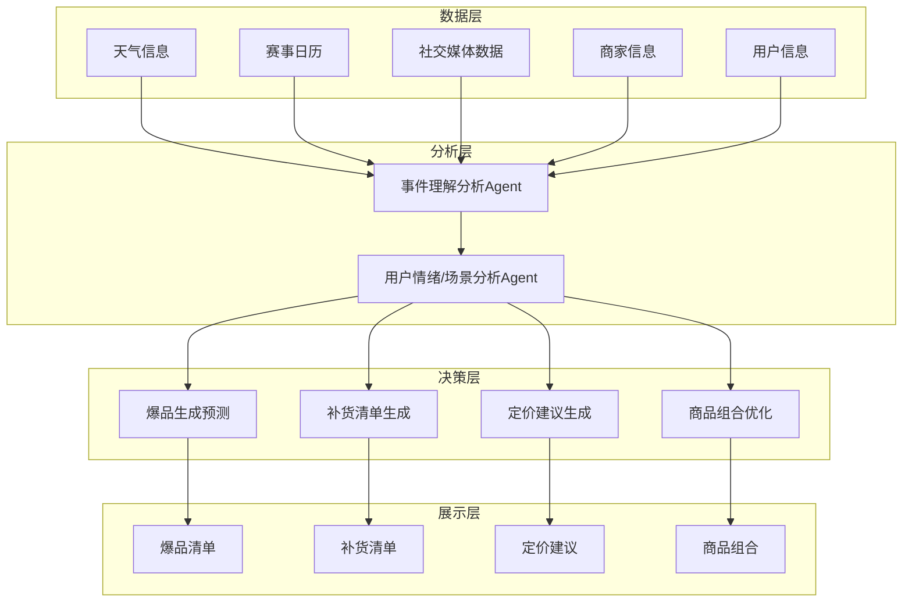

# 外卖夜间爆品预测项目架构图

## 架构说明

### 数据层
- **天气信息**：提供天气条件数据
- **赛事日历**：提供体育赛事安排信息
- **社交媒体数据**：收集社交媒体平台的热门话题和趋势
- **商家信息**：包含商家的商品信息、历史销售数据等
- **用户信息**：包含用户的消费习惯、偏好等数据

### 分析层
- **事件理解Agent**：处理和分析来自数据层的各类数据，理解外部事件和趋势
- **用户情绪/场景分析Agent**：基于事件理解Agent的输出，分析用户情绪和消费场景

### 决策层
- **爆品生成预测**：预测可能成为爆品的商品
- **补货清单生成**：根据预测结果生成补货建议
- **商品组合优化**：优化商品组合方案
- **定价建议生成**：提供商品定价建议

### 展示层
- **爆品清单**：展示预测的爆品列表
- **补货清单**：展示补货建议清单
- **定价建议**：展示商品定价建议
- **商品组合**：展示优化后的商品组合方案