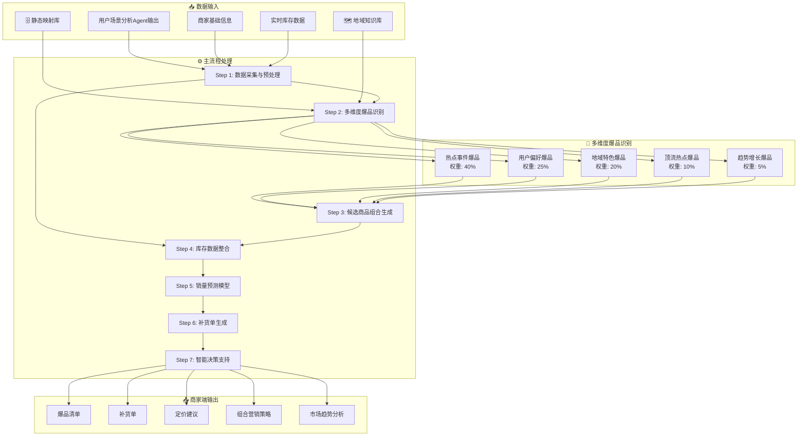
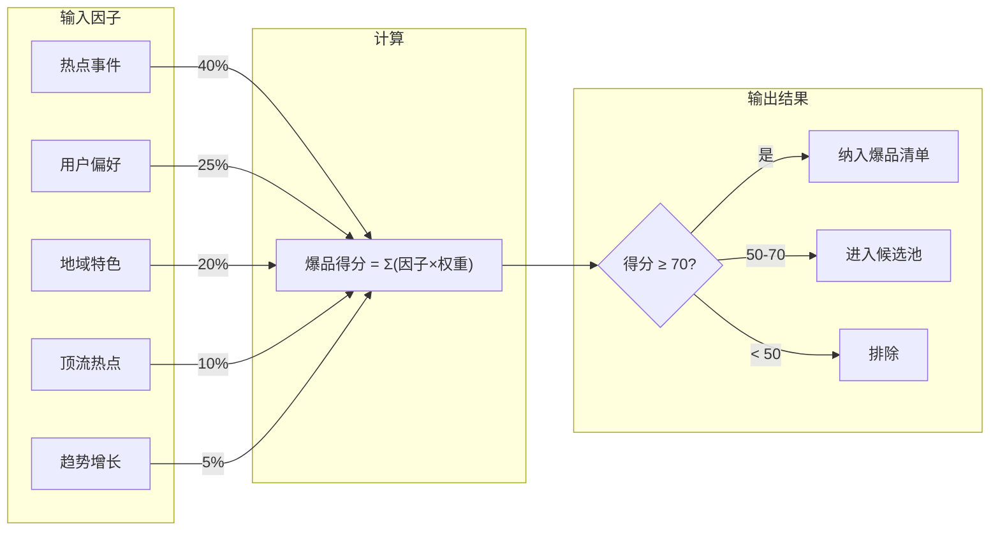
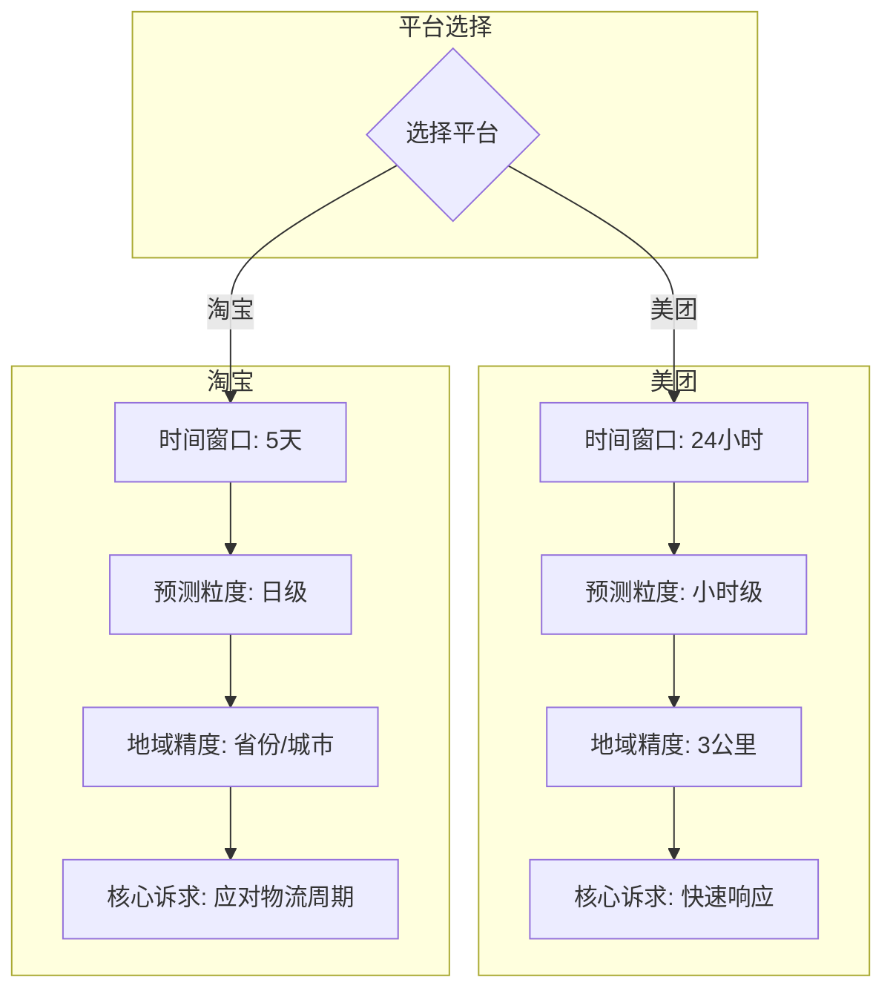

以下是决策层Agent标准操作流程(SOP)：

## 数据输入规范

### 输入数据来源

| 数据来源 | 数据类型 | 说明 |
|---------|---------|------|
| 用户场景分析Agent | 用户场景+潜在需求商品 | 包含用户ID、场景标签、推荐商品 |
| 商家基础信息档案 | 商家信息 | 地理位置、商品品类、配送范围 |
| 静态映射库 | 事件-爆品映射 | 月度更新的事件与爆品对应关系 |
| 地域知识库 | 地域特性 | 城市-节日-商品对应关系 |

### 数据分层策略

**核心优化**：主流程按日仅处理动态数据，静态数据按需调用

1. **动态数据（每日处理）**：
   - 用户场景分析Agent实时输出
   - 商家实时库存数据
   - 当前事件热度及匹配商品

2. **静态数据（按需调用）**：
   - 商家基础品类体系（月度更新）
   - 事件-爆品映射关系（直接匹配）
   - 地域饮食特性（按城市查询）

---

## 核心场景优先级（V1.0优先实现）

### MVP阶段核心目标

**核心痛点**：避免滞销、精准备货

| 功能优先级 | 模块 | 说明 |
|-----------|------|------|
| P0 | 补货清单生成 | 基于预测销量的精准补货建议 |
| P0 | 爆品清单 | 识别当前及未来爆品 |
| P1 | 动态定价 | 滞销品降价、爆品促销 |
| P2 | 商品组合 | 套餐搭配建议 |
| P3 | 提前预测 | 未来爆品预判 |

### 迭代路径

```
V1.0 → V1.1 → V2.0
 ↓      ↓       ↓
补货+   +定价   +提前预测
爆品    +组合   +全平台
```

---

## 主流程执行逻辑

### Step 1 - 数据采集与预处理

- **获取商家基础信息**：
  - 门店地理位置（经纬度、周边交通情况）
  - 商品完整品类体系（一级分类、二级分类、细分属性）
  - 配送范围边界

- **获取实时库存**：
  - 在售商品SKU信息
  - 实时库存数量、库存周转率
  - 库存预警阈值
  - 库存状态标记：充足/正常/紧张/缺货

### Step 2 - 多维度爆品识别

**核心逻辑**：突破单一用户偏好，整合多维度因素识别爆品

#### 爆品来源矩阵

| 爆品类型 | 数据来源 | 识别条件 | 优先级权重 |
|---------|---------|---------|-----------|
| 热点事件爆品 | 事件-爆品映射 | 事件热度>80 + 映射命中 | 40% |
| 用户偏好爆品 | 用户场景分析 | 用户推荐优先级=高 | 25% |
| 地域特色爆品 | 地域知识库 | 城市匹配 + 历史销量Top20 | 20% |
| 顶流热点爆品 | 社交媒体 | 事件类型=明星热点 + 热度>85 | 10% |
| 趋势增长爆品 | 销量数据 | 近7天销量增长>50% | 5% |

#### 爆品识别算法

```python
爆品得分 = (
    热点事件得分 × 0.40 +
    用户偏好得分 × 0.25 +
    地域特色得分 × 0.20 +
    顶流热点得分 × 0.10 +
    趋势增长得分 × 0.05
)
```

**阈值规则**：
- 得分≥70：直接纳入爆品清单
- 得分50-70：进入候选池，需人工确认
- 得分<50：不纳入爆品清单

### Step 3 - 候选商品组合生成

**核心逻辑**：结合商家在售商品与用户需求，构建候选池

- **商品来源**：
  - 商家在售商品（同品类匹配）
  - 用户场景分析推荐的潜在需求商品
  - 事件-爆品映射中的关联商品
  - 地域特性推荐商品

- **组合池覆盖**：
  - 基础需求商品（高频刚需）
  - 季节性商品（当前时令）
  - 趋势性商品（热点驱动）
  - 地域特色商品（城市特性）

### Step 4 - 库存数据整合

- **采集信息**：
  - 所有在售商品SKU
  - 实时库存数量
  - 库存周转率
  - 库存预警阈值

- **状态标记**：
  - 充足：库存>安全库存×2
  - 正常：安全库存<库存≤安全库存×2
  - 紧张：预警阈值<库存≤安全库存
  - 缺货：库存≤预警阈值

### Step 5 - 销量预测模型应用

#### 预测时间窗口（平台差异化）

| 平台 | 时间窗口 | 预测粒度 | 说明 |
|-----|---------|---------|------|
| 美团 | 未来24小时 | 小时级 | 即时零售，快速响应 |
| 淘宝 | 未来5天 | 日级 | 电商物流，需提前备货 |

#### 预测因子

- **历史销量因子**：
  - 近3个月数据（长期趋势）
  - 近1个月数据（中期波动）
  - 近7天数据（短期变化）

- **事件热度因子**：
  - 节假日因子（节日效应）
  - 促销活动因子（营销影响）
  - 地域热点因子（本地事件）

- **外部数据因子**：
  - 天气预报（天气影响）
  - 赛事日历（赛事影响）
  - 社交热点（趋势影响）

#### 预测算法

```
预测销量 = α × 历史基准 + β × 事件热度 + γ × 外部因子
```

其中：
- α + β + γ = 1
- 各因子权重根据历史数据训练确定

### Step 6 - 补货单生成（核心功能）

**核心目标**：精准备货，避免滞销和缺货

#### 生成规则

| 库存状态 | 预测销量>安全库存 | 补货策略 |
|---------|-----------------|---------|
| 充足 | 否 | 不补货 |
| 正常 | 否 | 不补货 |
| 紧张 | 是 | 按预测缺量补货 |
| 缺货 | 是 | 按预测销量+安全库存补货 |
| 任何状态 | 否（预测销量<当前库存） | 促销清库存 |

#### 补货优先级

| 优先级 | 条件 | 建议 |
|-------|------|------|
| P0 | 缺货 + 高预测销量 | 立即补货，2小时内到货 |
| P1 | 紧张 + 高预测销量 | 24小时内补货 |
| P2 | 正常/充足 + 高预测销量 | 提前备货 |
| P3 | 滞销风险商品 | 降价促销，减少补货 |

### Step 7 - 智能决策支持

调用大模型进行个性化分析，针对每个商家生成：

#### 商品组合策略

- 基于用户偏好和商品关联性
- 推荐组合示例：
  - 看球场景：啤酒+炸鸡+零食
  - 加班场景：泡面+咖啡+能量饮料

#### 补货优先级建议

- 按紧急程度和销售贡献度排序
- 输出格式：
  ```json
  {
    "商品ID": "xxx",
    "补货优先级": "P0/P1/P2/P3",
    "紧急原因": "缺货+高预测"
  }
  ```

#### 动态定价方案

| 商品类型 | 定价策略 | 调整幅度 |
|---------|---------|---------|
| 爆品且库存充足 | 维持原价或降价促销 | 最高10%降价 |
| 滞销风险商品 | 执行降价处理 | 8折 |
| 组合套餐商品 | 打包优惠价 | 套餐价<单品价之和 |
| 其他商品 | 成本+竞争定价 | 随行就市 |

---

## 平台差异化支持

### 美团（即时零售）

- **地域精度**：按商家周边3公里范围
- **预测窗口**：未来24小时，小时级粒度
- **核心诉求**：快速响应，避免缺货
- **数据时效**：实时或准实时更新

### 淘宝（电商）

- **地域精度**：按省份/城市维度
- **预测窗口**：未来5天，日级粒度
- **核心诉求**：提前备货，应对物流周期
- **数据需求**：需提前获取天气预报、赛事日历等预测数据
- **补货周期**：需考虑2-3天物流时效

---

## 商家端输出展示规范

```json
{
  "爆品清单": [
    {
      "商品ID": "xxx",
      "商品名称": "xxx",
      "爆品类型": "热点事件/用户偏好/地域特色/顶流热点/趋势增长",
      "爆品得分": 85,
      "当前销量": 100,
      "库存状态": "充足/正常/紧张/缺货",
      "推荐策略": "维持补货/促销清库存/组合销售",
      "相关事件": "世界杯决赛"
    }
  ],
  "补货单": [
    {
      "商品ID": "xxx",
      "建议补货数量": 50,
      "紧急程度": "P0/P1/P2/P3",
      "预计到货周期": "2小时/24小时/3天",
      "补货原因": "缺货+高预测销量"
    }
  ],
  "定价建议": [
    {
      "商品ID": "xxx",
      "当前价格": 10.0,
      "建议价格": 9.0,
      "调整幅度": "-10%",
      "实施理由": "爆品促销/滞销清货/组合优惠"
    }
  ],
  "组合营销策略": [
    {
      "组合商品IDs": ["xxx", "yyy"],
      "套餐价格": 25.0,
      "单品价格之和": 30.0,
      "优惠幅度": "-17%",
      "推荐销售场景": "看球场景",
      "预期效果": "客单价提升20%"
    }
  ],
  "市场趋势分析": {
    "品类销售趋势": "啤酒类夜间销量上涨15%",
    "竞争态势": "周边3公里内有2家竞争店铺",
    "潜在机会点": "冰品需求激增，建议加大备货",
    "风险预警": "卤味类库存积压风险，建议促销"
  }
}
```

---

## 核心痛点优先策略

### V1.0版本（当前迭代）

**聚焦避免滞销、精准备货**：

1. **滞销预防**：
   - 滞销商品识别（库存周转>30天）
   - 降价建议生成
   - 促销方案推荐

2. **精准备货**：
   - 销量预测（多因子融合）
   - 安全库存计算
   - 补货量精准建议

3. **爆品识别**：
   - 热点事件匹配
   - 用户偏好整合
   - 地域特性考虑

### V1.1+版本（未来迭代）

**拓展功能**：

- 动态定价优化
- 商品组合推荐
- 提前爆品预测
- 全平台支持

---

## 质量控制要求

| 指标 | 要求 | 说明 |
|------|------|------|
| 计算延迟 | ≤3秒/商家 | 单个商家决策生成时间 |
| 补货准确率 | ≥90% | 预测销量与实际销量偏差<10% |
| 滞销识别率 | ≥85% | 滞销商品被正确识别的比例 |
| 爆品命中率 | ≥80% | 爆品清单中商品实际热销的比例 |
| 库存周转优化 | 提升20% | 通过精准补货降低库存周转天数 |

---

## 执行要求

1. **数据准确性**：所有步骤需确保数据准确性
2. **计算时效性**：单个商家决策生成不超过3秒
3. **日志记录**：保留操作日志以便审计和优化
4. **异常处理**：对数据缺失或模型调用失败有明确应对策略
5. **按商家独立计算**：确保每个商家数据隔离和独立计算

---

## 流程图



### 流程图说明

| 阶段 | 关键节点 | 说明 |
|------|---------|------|
| **数据采集** | Step 1 | 获取商家基础信息、实时库存 |
| **爆品识别** | Step 2 | 整合5个维度加权评分识别爆品 |
| **商品组合** | Step 3 | 构建候选商品池（同品类+推荐+映射） |
| **库存整合** | Step 4 | 采集SKU、库存、周转率、预警阈值 |
| **销量预测** | Step 5 | 多因子融合（历史+事件+外部） |
| **补货生成** | Step 6 | 基于预测和库存生成补货建议 |
| **智能决策** | Step 7 | 大模型生成定价、组合、趋势分析 |

### 多维度爆品识别算法



### 平台差异化处理



| 平台 | 时间窗口 | 预测粒度 | 地域精度 | 核心诉求 |
|-----|---------|---------|---------|---------|
| 美团 | 24小时 | 小时级 | 3公里 | 快速响应，避免缺货 |
| 淘宝 | 5天 | 日级 | 省份/城市 | 提前备货，应对物流 |