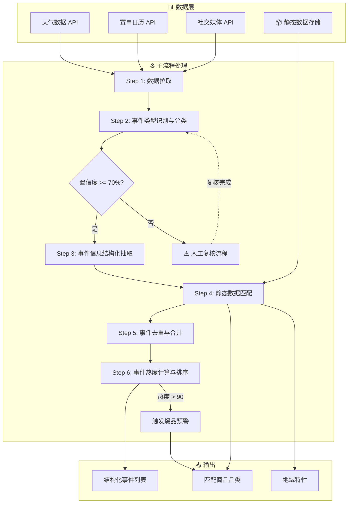

以下是事件理解分析Agent的标准操作流程（SOP）：

## 数据架构规范

### 数据分类原则

| 数据类型 | 定义 | 更新频率 | 示例 |
|---------|------|---------|------|
| 静态数据 | 历史积累的稳定映射关系 | 月/季度更新 | 用户偏好标签、事件-爆品对应关系（如世界杯对应啤酒/炸鸡）、地域饮食特性 |
| 动态数据 | 每日实时获取的外部事件 | 每日获取 | 天气预报、赛事日历、社交媒体热点、突发新闻 |

### 数据分离原则

1. **静态数据隔离存储**：
   - 用户画像标签独立存储于画像库
   - 事件-爆品映射关系独立存储于映射库
   - 地域特性数据独立存储于地域知识库

2. **动态数据每日拉取**：
   - 仅从外部API（天气、赛事日历、社交媒体）获取当日数据
   - 避免每日重复分析历史订单，节省TOKEN消耗

---

## 主流程执行逻辑

### Step 1 - 数据拉取（每日执行）

- **仅获取动态数据**：
  - 天气预报数据（未来24-72小时）
  - 赛事日历信息（未来24小时）
  - 社交媒体热门话题（实时）
  - 热搜新闻内容

- **数据格式规范**：
  ```json
  {
    "数据类型": "weather/event/social",
    "来源": "信息来源渠道",
    "获取时间": "ISO8601时间戳",
    "内容": "具体数据内容"
  }
  ```

### Step 2 - 事件类型识别与分类

- 调用轻量级大模型对动态事件进行语义理解与类型分类
- 分类体系至少包含：赛事、娱乐、天气、节日、明星热点、其他
- 支持动态扩展分类维度
- 分类准确率需达到90%以上
- 对分类置信度低于70%的事件进行人工复核标记

### Step 2.1 - 置信度计算规则

#### 大模型分类置信度计算原理

大模型的分类置信度是大模型在执行分类任务时返回的概率分数，反映了大模型对分类结果的确定程度。

##### 置信度输出机制

当调用大模型进行事件分类时，大模型会输出：
1. **分类结果**：具体的事件类型（如"世界杯"、"高温天气"等）
2. **置信度分数**：大模型对分类结果的确定程度（范围：0-1）

##### 置信度计算方式

大模型置信度的计算基于**softmax概率分布**：

```python
# 假设大模型输出logits：[2.5, 0.8, 1.2, 0.3]（对应4个分类）
# Step 1: 计算softmax概率
import numpy as np
logits = [2.5, 0.8, 1.2, 0.3]
exp_logits = np.exp(logits)
probabilities = exp_logits / np.sum(exp_logits)
# 输出：[0.72, 0.13, 0.12, 0.03]

# Step 2: 取最高概率作为置信度
confidence = max(probabilities)
# 输出：0.72（72%）

# Step 3: 分类结果为概率最高的类别
predicted_class = np.argmax(probabilities)
```

##### 置信度影响因素

大模型置信度受以下因素影响：

| 因素 | 影响说明 | 置信度表现 |
|------|---------|-----------|
| **事件特征明显性** | 事件特征越明显、越典型 | 置信度高（>90%） |
| **多义性** | 事件具有多种解释可能性 | 置信度中等（70-90%） |
| **训练数据覆盖** | 训练数据中类似事件多 | 置信度高 |
| **罕见事件** | 训练数据中极少出现 | 置信度低（<70%） |
| **上下文信息** | 提供的事件信息丰富程度 | 信息越丰富，置信度越高 |
| **模型能力** | 不同大模型的能力差异 | 能力强的模型置信度更准确 |

##### 不同场景的置信度特征

| 场景类型 | 示例 | 典型置信度范围 | 说明 |
|---------|------|--------------|------|
| **明确赛事** | "世界杯决赛今晚举行" | 90-98% | 事件特征非常明确 |
| **明确天气** | "北京气温突破40度" | 95-99% | 数据直接可判断 |
| **模糊娱乐** | "某明星疑似有新恋情" | 60-80% | 多义性较强 |
| **新兴热点** | "某网红突然爆火的新梗" | 50-70% | 缺乏历史数据参考 |
| **复合事件** | "下雨天+球赛推迟" | 70-85% | 需综合判断 |

##### 置信度校准机制

由于大模型置信度可能存在**过度自信**或**不够自信**的问题，需要进行校准：

```python
# 原始置信度
raw_confidence = 0.85  # 大模型输出

# 校准方法：温度缩放（Temperature Scaling）
temperature = 1.2  # 温度参数 >1 使分布更平滑

# 校准后置信度
calibrated_confidence = pow(raw_confidence, 1/temperature)
# 0.85^(1/1.2) = 0.88

# 或者使用Platt Scaling / Isotonic Regression进行更复杂的校准
```

##### 置信度获取示例（API调用）

```python
# 调用大模型API示例（以OpenAI兼容接口为例）
response = openai.ChatCompletion.create(
    model="gpt-3.5-turbo",
    messages=[
        {"role": "system", "content": "你是一个事件分类专家..."},
        {"role": "user", "content": "请判断这个事件的类型：'欧洲杯半决赛今晚开打'"}
    ]
)

# 获取置信度（logprobs）
logprobs = response.choices[0].logprobs
top_logprob = logprobs.content[0]
confidence = np.exp(top_logprob.logprob)  # 从logprob转换为概率

# 或者使用函数调用（Function Calling）方式
```

#### 置信度计算方法

综合置信度是衡量事件分类结果可靠性的核心指标，计算公式如下：

```
综合置信度 = 大模型置信度 × 来源可靠性系数 × 数据完整性系数
```

其中：
- **大模型置信度**：调用轻量级大模型（如Qwen、ChatGLM等）进行事件分类时返回的置信度分数（范围：0-1）
- **来源可靠性系数**：根据数据来源的可靠性进行调整（范围：0.5-1.0）
- **数据完整性系数**：根据事件信息的完整程度进行调整（范围：0.5-1.0）

#### 来源可靠性系数

| 数据来源 | 可靠性等级 | 系数值 |
|---------|-----------|--------|
| 官方天气预报API | 高 | 1.0 |
| 官方体育赛事API | 高 | 1.0 |
| 权威新闻媒体 | 高 | 0.95 |
| 社交媒体热搜（微博/抖音） | 中 | 0.85 |
| 用户生成内容 | 低 | 0.70 |
| 匿名爆料 | 低 | 0.50 |

#### 数据完整性系数

| 信息完整度 | 判断标准 | 系数值 |
|-----------|---------|--------|
| 完全完整 | 事件名+时间+地点+来源均齐全 | 1.0 |
| 基本完整 | 事件名+时间齐全，其他缺失 | 0.85 |
| 部分缺失 | 事件名齐全，时间或地点缺失 | 0.70 |
| 严重缺失 | 仅事件名，无其他信息 | 0.50 |

#### 综合置信度计算示例

**示例1：官方赛事数据**
```
大模型置信度 = 0.85（置信度较高）
来源可靠性系数 = 1.0（官方赛事API）
数据完整性系数 = 1.0（信息完整）
综合置信度 = 0.85 × 1.0 × 1.0 = 0.85（85%）
判定：正常进入分析流程，无需复核
```

**示例2：社交媒体热搜**
```
大模型置信度 = 0.75（置信度中等）
来源可靠性系数 = 0.85（社交媒体热搜）
数据完整性系数 = 0.85（基本完整）
综合置信度 = 0.75 × 0.85 × 0.85 = 0.54（54%）
判定：低于70%阈值，触发人工复核
```

**示例3：用户匿名爆料**
```
大模型置信度 = 0.90（置信度较高）
来源可靠性系数 = 0.50（匿名爆料）
数据完整性系数 = 0.50（严重缺失）
综合置信度 = 0.90 × 0.50 × 0.50 = 0.225（22.5%）
判定：严重低于70%阈值，必须人工复核
```

#### 置信度分级标准

| 置信度范围 | 分级 | 标识 | 处理方式 |
|-----------|------|------|---------|
| ≥90% | A级 | 🟢 高可信 | 直接采用分类结果，无需任何复核 |
| 70%-90% | B级 | 🔵 中可信 | 正常进入后续分析流程 |
| 50%-70% | C级 | 🟡 待复核 | 触发人工复核，2小时内完成复核 |
| <50% | D级 | 🔴 低可信 | 强制人工复核，高优先级处理 |

#### 置信度阈值调整机制

- **赛事类事件阈值提升**：重要赛事类事件（热度>90）的置信度阈值自动提升至80%
- **热点事件阈值降低**：突发热点事件（如明星塌房、突发新闻）可适当降低阈值至60%
- **历史数据参考**：若事件在历史映射表中存在且匹配度高，置信度自动上调10%

#### 置信度质量监控

| 监控指标 | 计算方法 | 目标值 |
|---------|---------|--------|
| 复核率 | 触发复核事件数 / 总事件数 | <15% |
| 复核修改率 | 复核后修改分类数 / 复核事件数 | <5% |
| 高置信度占比 | 置信度≥90%事件数 / 总事件数 | >60% |
| 低置信度占比 | 置信度<50%事件数 / 总事件数 | <5% |

### Step 3 - 事件信息结构化抽取

- 对每个已分类事件进行关键信息抽取，生成标准化结构数据：
  ```json
  {
    "事件名": "[具体事件名称]",
    "类型": "[对应分类结果]",
    "时间": "[精确到分钟的时间信息]",
    "地点": "[具体地点描述]",
    "来源": "[信息来源渠道]",
    "摘要": "[事件核心内容摘要]",
    "相关实体": ["涉及的人物、组织等实体列表"],
    "关联商品品类": ["基于静态映射推断可能的商品品类"]
  }
  ```
- 确保关键信息字段的完整性，缺失字段需标记为"待补充"

### Step 4 - 静态数据匹配（关键优化点）

**核心逻辑**：每日主流程不再重复分析历史订单，而是通过动态事件匹配静态映射表

- **事件-爆品映射匹配**：
  - 从静态数据中获取"事件-爆品对应关系"知识库
  - 将识别出的事件类型与映射表进行匹配
  - 匹配规则示例：
    ```json
    {
      "世界杯/欧洲杯": ["啤酒", "炸鸡", "零食", "饮料"],
      "七夕节": ["巧克力", "红酒", "鲜花"],
      "高温预警": ["冰淇淋", "冷饮", "西瓜"]
    }
    ```

- **地域特性匹配**：
  - 结合商家地理位置，从地域知识库中获取该区域的饮食特性
  - 示例：
    ```json
    {
      "北方城市_元宵节": ["元宵"],
      "南方城市_元宵节": ["汤圆"],
      "重庆_夏季": ["小龙虾", "冰啤"]
    }
    ```

### Step 5 - 事件去重与合并机制

- 采用"事件名+时间"双重匹配机制进行事件去重（时间匹配精度为±5分钟）
- 对判定为同一事件的多源信息进行智能合并，保留最完整的描述内容
- 合并过程中需记录所有信息来源，建立溯源机制

### Step 6 - 事件热度计算与排序

#### 6.1 热度数据获取

事件热度计算依赖于多源热度数据，系统需从以下平台获取原始热度指标：

##### 数据获取规范

| 数据源 | 热度指标 | 获取方式 | 权重 |
|--------|---------|---------|------|
| 社交媒体（微博/抖音/小红书） | 浏览量、点赞量、转发量、评论量 | 平台API | 30% |
| 新闻媒体（新浪/腾讯/网易） | 浏览量、评论量、收藏量 | 新闻API | 25% |
| 搜索引擎（百度/搜狗） | 搜索指数、点击量 | 搜索指数API | 25% |
| 电商平台（淘宝/京东） | 搜索量、加购量、下单量 | 电商API | 20% |

##### 数据格式规范

```json
{
  "事件ID": "event_001",
  "平台数据": {
    "微博": {
      "浏览量": 1200000,
      "点赞量": 85000,
      "转发量": 32000,
      "评论量": 15000,
      "数据获取时间": "2024-06-15T22:00:00Z"
    },
    "抖音": {
      "浏览量": 5600000,
      "点赞量": 230000,
      "转发量": 45000,
      "评论量": 67000,
      "数据获取时间": "2024-06-15T22:00:00Z"
    },
    "百度指数": {
      "搜索指数": 85000,
      "资讯指数": 120000,
      "数据获取时间": "2024-06-15T22:00:00Z"
    }
  }
}
```

#### 6.2 基础热度计算

##### 6.2.1 单平台热度计算

每个平台内部需将多个指标加权融合为该平台的单一热度值：

```
平台热度 = 浏览量 × 40% + 点击量 × 60%
```

**详细指标映射**：

| 平台 | 浏览量指标 | 点击量指标 |
|------|----------|-----------|
| 微博 | 浏览量×40% | (点赞量 + 转发量×2 + 评论量×3)×60% |
| 抖音 | 浏览量×40% | (点赞量 + 转发量×2 + 评论量×3)×60% |
| 新闻媒体 | 浏览量×40% | (评论量 + 收藏量×2)×60% |
| 搜索引擎 | 搜索指数×40% | (点击量×60%) |

##### 6.2.2 综合热度计算

整合所有平台数据，计算最终综合热度：

```python
def 计算综合热度(平台数据列表):
    """
    平台数据列表：包含各平台的原始热度数据
    """
    # Step 1: 计算各平台热度
    平台热度列表 = []
    for 平台数据 in 平台数据列表:
        平台热度 = 平台数据.浏览量 × 0.4 + 平台数据.点击量 × 0.6
        平台热度列表.append({
            "平台": 平台数据.平台名,
            "热度": 平台热度,
            "权重": 平台数据.权重
        })
    
    # Step 2: 加权求和
    综合热度 = sum(平台.热度 × 平台.权重 for 平台 in 平台热度列表)
    
    return 综合热度
```

**计算示例**：

```python
# 示例数据
微博数据 = {"浏览量": 1200000, "点赞量": 85000, "转发量": 32000, "评论量": 15000}
抖音数据 = {"浏览量": 5600000, "点赞量": 230000, "转发量": 45000, "评论量": 67000}
百度数据 = {"搜索指数": 85000, "资讯指数": 120000}

# Step 1: 计算各平台热度
微博热度 = 1200000 × 0.4 + (85000 + 32000×2 + 15000×3) × 0.6
         = 480000 + 111000 = 591000

抖音热度 = 5600000 × 0.4 + (230000 + 45000×2 + 67000×3) × 0.6
         = 2240000 + 447000 = 2687000

百度热度 = 85000 × 0.4 + 120000 × 0.6 = 34000 + 72000 = 106000

# Step 2: 加权求和（微博30% + 抖音25% + 新闻25% + 百度20%）
综合热度 = 591000 × 0.30 + 2687000 × 0.25 + 591000 × 0.25 + 106000 × 0.20
        = 177300 + 671750 + 147750 + 21200 = 1018000
```

#### 6.3 热度标准化处理

##### 6.3.1 标准化方法

由于不同事件的原始热度数值差异巨大（从几百到几千万），需要进行标准化处理：

```python
import numpy as np
import math

def 标准化热度(原始热度, 参考数据集):
    """
    采用对数变换 + Min-Max标准化方法
    - 对数变换：处理极值差异
    - Min-Max标准化：映射到0-100区间
    """
    # Step 1: 对数变换（处理极值，避免大数压制小数）
    log热度 = math.log(1 + 原始热度)
    
    # Step 2: 计算参考数据集的统计量
    log热度列表 = [math.log(1 + h) for h in 参考数据集]
    log热度_max = max(log热度列表)
    log热度_min = min(log热度列表)
    log热度_mean = np.mean(log热度列表)
    
    # Step 3: Min-Max标准化
    if log热度_max == log热度_min:
        标准化热度 = 50  # 所有事件热度相同
    else:
        标准化热度 = ((log热度 - log热度_min) / (log热度_max - log热度_min)) × 100
    
    return round(标准化热度, 2)
```

##### 6.3.2 标准化示例

```python
# 参考数据集（过去7天的所有事件热度）
参考热度 = [120000, 5600000, 85000, 1200000, 340000, 8900000, 230000]

# 假设当前事件原始热度
当前事件热度 = 1018000

# 标准化计算
log当前 = log(1 + 1018000) = 13.83
log参考 = [log(1 + h) for h in 参考热度]
# = [11.70, 15.54, 11.35, 13.99, 12.73, 16.00, 12.35]

log_max = 16.00
log_min = 11.35

标准化热度 = ((13.83 - 11.35) / (16.00 - 11.35)) × 100
          = (2.48 / 4.65) × 100
          = 53.33

print(f"标准化后热度: {53.33}")
```

#### 6.4 时间衰减函数

##### 6.4.1 衰减模型

事件热度随时间推移会逐渐降低，需引入时间衰减因子：

```python
def 时间衰减因子(事件创建时间, 当前时间, 半衰期_小时=24):
    """
    指数衰减模型
    半衰期：热度降到一半所需的时间
    
    参数：
    - 事件创建时间：datetime，事件首次出现的时间
    - 当前时间：datetime，计算热度的时间点
    - 半衰期_小时：int，默认24小时（可调整）
    
    返回：
    - 衰减因子：float，范围(0, 1]
    """
    import datetime
    
    # 计算事件年龄（小时）
    事件年龄_小时 = (当前时间 - 事件创建时间).total_seconds() / 3600
    
    # 指数衰减公式
    衰减因子 = math.exp(-0.693 × 事件年龄_小时 / 半衰期_小时)
    
    return 衰减因子
```

##### 6.4.2 半衰期设定

不同类型事件的热度衰减速度不同：

| 事件类型 | 半衰期 | 说明 |
|---------|--------|------|
| 突发新闻 | 6-12小时 | 热度爆发快，下降也快 |
| 体育赛事 | 12-24小时 | 与赛事周期相关 |
| 娱乐热点 | 24-48小时 | 持续时间较长 |
| 节日庆典 | 48-72小时 | 与节日周期相关 |
| 常规天气 | 24小时 | 每天更新 |

##### 6.4.3 时间衰减示例

```python
# 示例：世界杯决赛事件
事件创建时间 = datetime(2024, 6, 15, 22, 0, 0)  # 决赛结束时间
当前时间 = datetime(2024, 6, 16, 10, 0, 0)      # 第二天上午10点
事件年龄 = 12小时
半衰期 = 24小时（体育赛事）

衰减因子 = exp(-0.693 × 12 / 24) = exp(-0.3465) = 0.707

# 原始标准化热度 = 85
# 时间衰减后热度 = 85 × 0.707 = 60.1
```

#### 6.5 最终热度计算

##### 6.5.1 完整计算流程

```python
def 计算最终热度(事件ID, 平台数据列表, 事件创建时间, 当前时间):
    """
    完整的事件热度计算流程
    """
    # Step 1: 获取原始热度数据
    原始数据 = 获取热度数据(事件ID)
    
    # Step 2: 计算综合热度
    综合热度 = 计算综合热度(原始数据.平台数据列表)
    
    # Step 3: 标准化处理
    参考数据 = 获取参考热度数据集()  # 过去7天所有事件
    标准化热度 = 标准化热度(综合热度, 参考数据)
    
    # Step 4: 时间衰减
    衰减因子 = 时间衰减因子(事件创建时间, 当前时间)
    最终热度 = 标准化热度 × 衰减因子
    
    # Step 5: 四舍五入到整数
    最终热度 = round(最终热度)
    
    return 最终热度
```

##### 6.5.2 计算示例

```python
# 输入数据
事件ID = "event_worldcup_final"
平台数据 = {
    "微博": {"浏览量": 1200000, "点赞量": 85000, "转发量": 32000, "评论量": 15000},
    "抖音": {"浏览量": 5600000, "点赞量": 230000, "转发量": 45000, "评论量": 67000},
    "百度": {"搜索指数": 85000, "资讯指数": 120000}
}
事件创建时间 = datetime(2024, 6, 15, 22, 0, 0)
当前时间 = datetime(2024, 6, 16, 10, 0, 0)

# 计算过程
综合热度 = 1018000
标准化热度 = 53.33
衰减因子 = 0.707
最终热度 = round(53.33 × 0.707) = round(37.7) = 38

print(f"最终热度: {最终热度}")
```

#### 6.6 热度阈值触发

| 热度范围 | 标识 | 级别 | 处理方式 |
|---------|------|------|---------|
| >90 | 🔥🔥🔥 极高热 | A级 | **自动触发爆品预警**，优先推送至决策层，触发紧急补货流程 |
| 80-90 | 🔥🔥 高热 | B级 | 强烈推荐进入爆品清单，高优先级处理 |
| 70-80 | 🔥 中高热 | C级 | 正常进入分析流程，建议纳入爆品清单 |
| 60-70 | 🔵 中热 | D级 | 正常进入分析流程，观察是否上升 |
| 50-60 | 🔵 中低热 | E级 | 标记为观察对象 |
| <50 | ⚪ 低热 | F级 | 标记为低优先级事件，不进入爆品预测 |

#### 6.7 热度排名

##### 排名规则

- **同类型排名**：在同一事件类型（如"赛事"、"娱乐"）内按热度排序
- **全局排名**：在所有事件中按热度排序
- **更新频率**：每小时更新一次排名

##### 排名输出格式

```json
{
  "事件名": "[具体事件名称]",
  "类型": "[对应分类结果]",
  "时间": "[精确到分钟的时间信息]",
  "地点": "[具体地点描述]",
  "事件热度": "[0-100标准化热度值]",
  "热度排名": {
    "全局排名": 15,
    "同类型排名": 3,
    "热度级别": "B级"
  },
  "来源": ["合并后的信息来源列表"],
  "摘要": "[事件核心内容摘要]",
  "匹配商品品类": ["基于静态映射的关联商品品类列表"],
  "地域特性": ["该地区对应的特殊饮食需求"]
}
```

---

## 平台差异化支持（扩展功能）

### 美团（即时零售场景）
- 地域预测精度：按商家周边3公里范围预测
- 预测时间窗口：未来24小时，小时级粒度
- 数据时效性：实时或准实时更新

### 淘宝（电商场景）
- 预测时间窗口：未来5天，应对物流周期
- 数据需求：需提前获取天气预报、赛事日历等预测数据
- 地域精度：可按省份/城市维度预测

---

## 质量控制要求

| 指标 | 要求 |
|------|------|
| 全流程处理延迟 | 不超过5分钟 |
| 事件分类错误率 | 低于5% |
| 信息抽取完整率 | 不低于95% |
| 去重准确率 | 不低于98% |
| 静态数据命中率 | 不低于85%（新事件能在映射表中找到匹配项）|

---

## 置信度低于70%的人工复核流程

当事件分类置信度低于70%时，系统自动触发人工复核流程：

```json
{
  "复核流程": {
    "触发条件": "置信度 < 70%",
    "通知方式": "企业微信群推送 + 邮件通知",
    "响应时效": "2小时内完成复核",
    "复核角色": "运营专员",
    "复核入口": "运营后台人工复核模块",
    "回写机制": "自动覆盖原数据并记录复核人、时间戳"
  }
}
```

**复核工作流详细说明**：

| 步骤 | 操作 | 执行人 | 系统动作 |
|------|------|-------|---------|
| 1 | 事件进入复核队列 | 系统 | 发送企业微信群通知 |
| 2 | 运营专员登录复核后台 | 运营专员 | 查看事件详情和原始数据 |
| 3 | 人工判定分类和热度 | 运营专员 | 选择分类标签并填写置信度 |
| 4 | 提交复核结果 | 运营专员 | 数据写入并触发下游流程 |
| 5 | 复核记录归档 | 系统 | 记录完整操作日志 |

**复核后台功能要求**：

- 列表展示：待复核事件按时间倒序排列，显示事件摘要、原始分类、置信度
- 详情查看：展示事件完整信息、来源数据、多条候选分类
- 快捷操作：支持"确认原始分类"或"修改分类"两种操作
- 批量处理：支持批量复核，提高处理效率
- 统计报表：显示复核数量、复核率、平均处理时长

**未复核事件处理规则**：

- 超过24小时未复核的事件，自动采用置信度最高的分类结果
- 重要赛事类事件（热度>90）自动提升为高优先级，强制2小时内复核
- 连续3次进入复核队列的事件，标记为"高频疑难事件"，自动告警给负责人

---

## 流程图



### 流程图说明

| 阶段 | 关键节点 | 说明 |
|------|---------|------|
| **数据拉取** | Step 1 | 仅获取动态数据（天气/赛事/社交媒体） |
| **事件分类** | Step 2 | 轻量级大模型分类，置信度<70%触发人工复核 |
| **结构化抽取** | Step 3 | 抽取关键信息，生成标准化JSON |
| **静态匹配** | Step 4 | 通过静态映射表匹配事件-爆品关系 |
| **去重合并** | Step 5 | "事件名+时间"双重匹配去重 |
| **热度计算** | Step 6 | 浏览量40%+点击量60%，标准化0-100分 |
| **爆品预警** | 热度>90 | 自动触发爆品预警，优先推送决策层 |