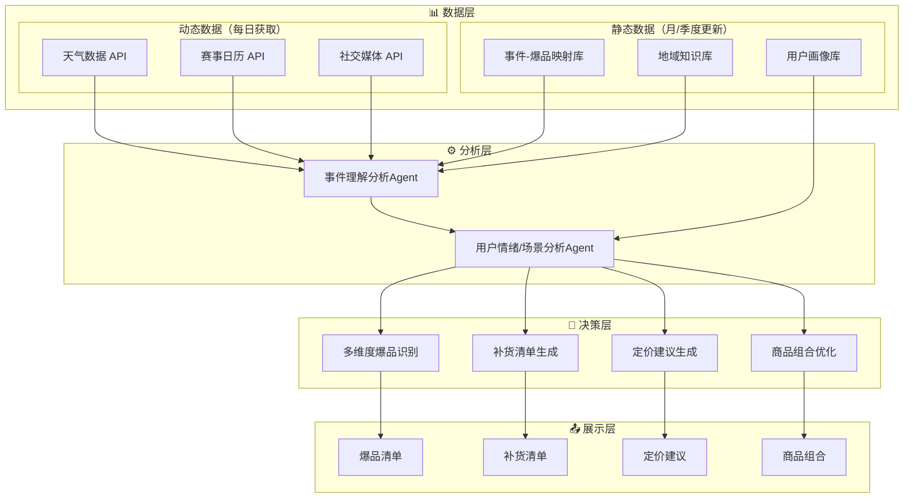
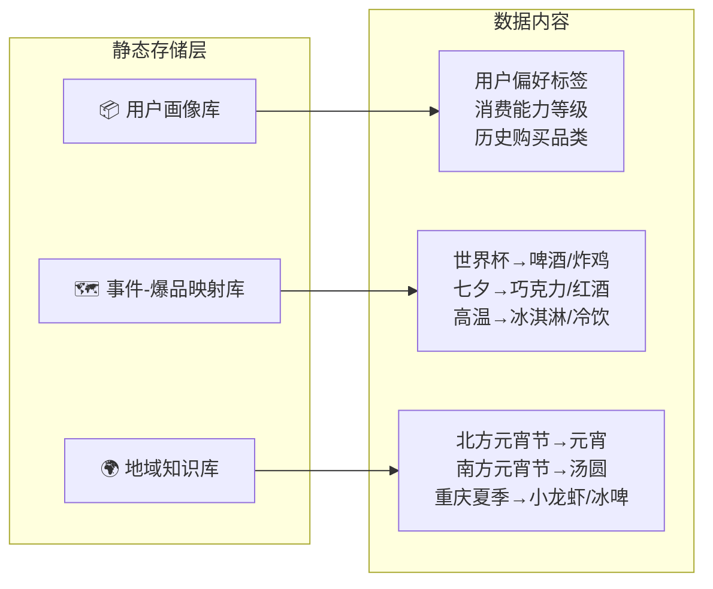

# AI夜宵爆品预测助手 - 产品需求文档（PRD）

## 文档信息

| 属性 | 内容 |
|------|------|
| 产品名称 | AI夜宵爆品预测助手 |
| 产品定位 | 即时零售夜间场景的B端智能决策SaaS服务 |
| 文档版本 | V2.0 |
| 编订日期 | 2026-03-22 |
| 更新说明 | 优化数据处理逻辑、多维度爆品识别、平台差异化支持 |

---

## 1. 产品概述

### 1.1 背景与市场机会

"即时零售"（线上下单，30分钟送达）已成为夜间消费的重要渠道。根据美团研究院数据显示，2023年即时零售夜间时段（20:00-次日6:00）订单量同比增长42%，显著高于全天平均水平。

在24小时便利店中，夜间订单占全天订单的20%-30%。夜间消费呈现独特的品类结构：冰品（雪糕/冰淇淋）夜间订单占比高达35%（对比白天仅15%）；啤酒/洋酒夜间贡献全天60%的线上酒水订单；速食（泡面/自热锅/卤味）夜间订单占比45%；零食/饮料中碳酸饮料、功能饮料、膨化食品占比显著提升。

然而，夜间经营面临严峻挑战：因缺货导致的便利店夜间销售损失平均达8%-12%，以一家单店月均夜间GMV 5万元计算，缺货损失就高达4000-6000元；夜间备货不当导致的食品过期损耗率是日间的2倍。

### 1.2 核心痛点

夜间经营面临严峻挑战，这些痛点是本产品需要解决的核心问题：

| 痛点类型 | 具体表现 | 影响程度 |
|---------|---------|---------|
| **缺货损失** | 因缺货导致的便利店夜间销售损失平均达8%-12% | 一家单店月均夜间GMV 5万元，缺货损失4000-6000元/月 |
| **滞销损耗** | 夜间备货不当导致的食品过期损耗率是日间的2倍 | 库存周转慢，资金占用高 |
| **预测困难** | 商家依赖经验备货，无法精准预判夜间消费趋势 | 备货要么过多要么过少 |
| **响应滞后** | 缺乏实时数据分析能力，错失销售机会 | 无法抓住热点事件带来的销量爆发 |

### 1.3 核心价值主张

开发"AI夜宵爆品预测助手"，通过人工智能技术精准预测夜间消费趋势，为商家提供从备货建议到营销方案的全流程解决方案，实现：

- **预测-决策-执行-反馈** 完整闭环
- **避免滞销、精准备货** - 核心优先解决的核心痛点
- **多维度爆品识别** - 突破单一用户偏好，整合热点事件、地域特性、顶流推荐
- 降低缺货损失和滞销损耗
- 提升夜间经营效率和盈利能力

### 1.4 目标用户

- 中小便利店商家
- 闪电仓（前置仓）商家
- 面向即时零售夜间场景的各类零售商
- **扩展目标**：淘宝/天猫即时零售商家（需支持电商场景）

### 1.5 核心设计原则

遵循以下核心设计原则，确保产品架构的合理性和可扩展性：

| 原则 | 说明 | 实现方式 |
|------|------|---------|
| **静态动态分离** | 避免每日重复计算历史数据，节省TOKEN | 静态数据月/季度更新，动态数据每日拉取 |
| **多维度爆品** | 突破单一用户偏好限制 | 整合热点事件、地域特性、顶流推荐 |
| **平台差异化** | 兼容不同平台场景需求 | 美团（24小时即时零售）vs 淘宝（5天电商物流）|
| **核心痛点优先** | 先解决商家最关心的问题 | V1.0聚焦避免滞销、精准备货 |

---

## 2. 产品功能架构

### 2.1 系统架构图



### 2.2 数据架构规范

#### 2.2.1 数据分类原则

| 数据类型 | 定义 | 更新频率 | 示例 |
|---------|------|---------|------|
| **静态数据** | 历史积累的稳定映射关系 | 月/季度更新 | 用户偏好标签、事件-爆品对应关系、地域饮食特性 |
| **动态数据** | 每日实时获取的外部事件 | 每日获取 | 天气预报、赛事日历、社交媒体热点、突发新闻 |

#### 2.2.2 数据分离优势

| 优化项 | 原方案（未分离） | 新方案（分离后） | 优化效果 |
|--------|----------------|----------------|---------|
| TOKEN消耗 | 每日重复分析历史订单 | 仅查询静态映射表 | 节省80%+ TOKEN |
| 计算延迟 | 全量历史分析耗时 | 静态映射匹配毫秒级 | 提升50倍+ |
| 数据更新 | 实时更新困难 | 月/季度批量更新 | 维护成本降低 |
| 可扩展性 | 耦合度高 | 解耦，便于扩展 | 支持新维度新增 |

#### 2.2.3 静态数据存储



### 2.3 Agent边界定义

为避免各Agent职责交叉和输出重复，明确以下边界原则：

| 原则 | 说明 |
|------|------|
| 事件Agent专注 | 仅负责事件识别、分类、热度计算、去重；**不直接映射到用户场景** |
| 用户场景Agent专注 | 仅负责用户行为模式、实时订单分析、场景推理；**不处理事件分类** |
| 信息传递方式 | 事件热度仅作为用户场景分析的"上下文输入"，场景判断由用户行为主导 |
| 数据解耦 | 各Agent独立输出，下游Agent不直接依赖上游Agent的中间状态 |

**输入输出边界规范**：

| Agent | 输入 | 输出 | 不输出 |
|-------|------|------|--------|
| **事件理解分析Agent** | 天气/赛事/社交媒体原始数据<br/>静态映射库<br/>地域知识库 | 结构化事件列表{事件ID, 类型, 热度, 时间, 地点, 匹配商品品类} | 用户ID、用户场景、用户行为 |
| **用户场景分析Agent** | 用户订单数据 + 用户历史行为 + 事件上下文<br/>用户画像库 | 用户场景列表{用户ID, 场景, 潜在需求商品, 场景置信度} | 事件分类结果、事件热度值 |
| **决策层Agent** | 用户场景列表 + 商家库存/商品/位置数据<br/>实时库存 | 爆品清单/补货单/定价建议/组合策略 | 用户ID、事件类型 |

### 2.4 平台差异化支持

#### 2.4.1 美团（即时零售场景）

- **地域精度**：按商家周边3公里范围预测
- **预测时间窗口**：未来24小时，小时级粒度
- **数据时效性**：实时或准实时更新
- **核心诉求**：快速响应，避免缺货
- **适用商家**：便利店、闪电仓、前置仓

#### 2.4.2 淘宝（电商场景）

- **地域精度**：按省份/城市维度预测
- **预测时间窗口**：未来5天，日级粒度
- **数据时效性**：需提前获取天气预报、赛事日历等预测数据
- **核心诉求**：提前备货，应对物流周期（2-3天）
- **适用商家**：天猫超市、淘宝即时零售商家

#### 2.4.3 平台差异化对比

| 维度 | 美团 | 淘宝 |
|------|------|------|
| 预测时间窗口 | 24小时 | 5天 |
| 预测粒度 | 小时级 | 日级 |
| 地域精度 | 3公里 | 省份/城市 |
| 物流周期 | 即时（30分钟） | 2-3天 |
| 核心目标 | 避免缺货 | 提前备货 |
| 库存管理 | 实时库存 | 计划性补货 |

### 2.5 竞品能力对比

| 功能维度 | 淘宝闪购 | 京东外卖 | 美团外卖 | **本产品** |
|---------|---------|---------|---------|-----------|
| **多平台支持** | 仅淘宝 | 仅京东 | 仅美团 | ✅ 美团+淘宝+扩展 |
| **预测时间粒度** | 日/周 | 日 | 小时/日 | 小时级（提前24小时精准到夜间时段） |
| **外部特征融合** | 基本无 | 部分考虑促销 | 可定制 | 内置天气、事件、社交热点实时接口 |
| **夜间场景专项优化** | 无 | 无 | 需定制 | 原生设计，模型针对夜间消费行为训练 |
| **爆品预测维度** | 单一历史销量 | 单一销量 | 单一销量 | ✅ 多维度（热点+偏好+地域+顶流） |
| **静态动态数据分离** | 无 | 无 | 无 | ✅ 节省TOKEN，优化性能 |
| **地域特性支持** | 无 | 无 | 无 | ✅ 城市维度差异化预测 |
| **输出形式** | 报表、图表 | 补货单 | 预测数值API | 可视化爆品清单+补货建议+组合营销方案 |
| **操作闭环** | 需手动调整 | 可对接自动订货 | 需二次开发 | 一键采纳、效果追踪、反馈迭代 |
| **中小商家适配性** | 高 | 低 | 极低 | 中（SaaS模式，定价灵活） |

**本产品核心竞争优势**：

1. **多维度爆品识别**：突破单一销量维度，整合热点事件、地域特性、顶流推荐
2. **平台差异化**：同时支持美团（即时零售）和淘宝（电商）场景
3. **成本优化**：静态动态数据分离，节省80%+ TOKEN消耗
4. **精准预测**：城市维度差异化预测，考虑地域饮食特性

---

## 3. 功能需求详述

### 3.1 事件理解分析Agent

#### 3.1.1 功能概述

事件理解分析Agent负责从多数据源采集信息，处理和分析外部事件，理解事件类型、热度及对夜间消费的影响，**通过静态数据匹配生成事件-爆品映射**，为后续的用户场景分析提供输入。

**核心优化**：主流程每日仅从动态数据源获取当前事件，通过匹配静态映射表生成推荐，**避免每日重复分析历史订单，节省TOKEN消耗**。

#### 3.1.2 数据输入

| 数据类型 | 数据源 | 更新频率 | 说明 |
|---------|--------|---------|------|
| **动态数据** | 天气预报数据 | 每日获取 | 未来24-72小时天气预报 |
| **动态数据** | 赛事日历信息 | 每日获取 | 未来24小时赛事安排 |
| **动态数据** | 社交媒体热门话题 | 实时获取 | 微博/抖音/小红书热搜 |
| **动态数据** | 热搜新闻内容 | 实时获取 | 突发事件、明星热点 |
| **静态数据** | 事件-爆品映射库 | 月度更新 | 事件类型与爆品的对应关系 |
| **静态数据** | 地域知识库 | 季度更新 | 城市-节日-商品的对应关系 |

#### 3.1.3 处理流程

**Step 1 - 数据拉取（每日执行）**

- **仅获取动态数据**：
  - 天气预报数据（未来24-72小时）
  - 赛事日历信息（未来24小时）
  - 社交媒体热门话题（实时）
  - 热搜新闻内容

- **数据格式规范**：
  ```json
  {
    "数据类型": "weather/event/social",
    "来源": "信息来源渠道",
    "获取时间": "ISO8601时间戳",
    "内容": "具体数据内容"
  }
  ```

**Step 2 - 事件类型识别与分类**

- 调用轻量级大模型对动态事件进行语义理解与类型分类
- 分类体系至少包含：赛事、娱乐、天气、节日、明星热点、其他
- 支持动态扩展分类维度
- 分类准确率需达到90%以上
- 对分类置信度低于70%的事件进行人工复核标记

**Step 2.1 - 置信度计算规则**

#### 大模型分类置信度计算原理

大模型的分类置信度是大模型在执行分类任务时返回的概率分数，基于**softmax概率分布**计算：

```python
# logits转换为概率分布
logits = [2.5, 0.8, 1.2, 0.3]  # 对应4个分类
probabilities = softmax(logits)
# 输出：[0.72, 0.13, 0.12, 0.03]
confidence = max(probabilities)  # 取最高概率作为置信度
```

#### 置信度影响因素

| 因素 | 影响说明 | 置信度表现 |
|------|---------|-----------|
| 事件特征明显性 | 事件特征越明显、越典型 | 置信度高（>90%） |
| 多义性 | 事件具有多种解释可能性 | 置信度中等（70-90%） |
| 训练数据覆盖 | 训练数据中类似事件多 | 置信度高 |
| 罕见事件 | 训练数据中极少出现 | 置信度低（<70%） |

#### 不同场景的置信度特征

| 场景类型 | 示例 | 典型置信度范围 |
|---------|------|--------------|
| 明确赛事 | "世界杯决赛今晚举行" | 90-98% |
| 明确天气 | "北京气温突破40度" | 95-99% |
| 模糊娱乐 | "某明星疑似有新恋情" | 60-80% |
| 新兴热点 | "某网红突然爆火的新梗" | 50-70% |

#### 置信度计算方法

```
综合置信度 = 大模型置信度 × 来源可靠性系数 × 数据完整性系数
```

#### 来源可靠性系数

| 数据来源 | 可靠性等级 | 系数值 |
|---------|-----------|--------|
| 官方天气预报API | 高 | 1.0 |
| 官方体育赛事API | 高 | 1.0 |
| 权威新闻媒体 | 高 | 0.95 |
| 社交媒体热搜（微博/抖音） | 中 | 0.85 |
| 用户生成内容 | 低 | 0.70 |
| 匿名爆料 | 低 | 0.50 |

#### 数据完整性系数

| 信息完整度 | 判断标准 | 系数值 |
|-----------|---------|--------|
| 完全完整 | 事件名+时间+地点+来源均齐全 | 1.0 |
| 基本完整 | 事件名+时间齐全，其他缺失 | 0.85 |
| 部分缺失 | 事件名齐全，时间或地点缺失 | 0.70 |
| 严重缺失 | 仅事件名，无其他信息 | 0.50 |

#### 置信度分级标准

| 置信度范围 | 分级 | 处理方式 |
|-----------|------|---------|
| ≥90% | A级-高可信 | 直接采用，无需复核 |
| 70%-90% | B级-中可信 | 正常进入流程 |
| 50%-70% | C级-待复核 | 触发人工复核 |
| <50% | D级-低可信 | 强制复核，高优先级 |

**Step 3 - 事件信息结构化抽取**

- 对每个已分类事件进行关键信息抽取，生成标准化结构数据：
  ```json
  {
    "事件名": "[具体事件名称]",
    "类型": "[对应分类结果]",
    "时间": "[精确到分钟的时间信息]",
    "地点": "[具体地点描述]",
    "来源": "[信息来源渠道]",
    "摘要": "[事件核心内容摘要]",
    "相关实体": ["涉及的人物、组织等实体列表"],
    "关联商品品类": ["基于静态映射推断可能的商品品类"]
  }
  ```
- 确保关键信息字段的完整性，缺失字段需标记为"待补充"

**Step 4 - 静态数据匹配（关键优化点）**

**核心逻辑**：每日主流程不再重复分析历史订单，而是通过动态事件匹配静态映射表

- **事件-爆品映射匹配**：
  - 从静态数据中获取"事件-爆品对应关系"知识库
  - 将识别出的事件类型与映射表进行匹配
  - 匹配规则示例：
    ```json
    {
      "世界杯/欧洲杯": ["啤酒", "炸鸡", "零食", "饮料"],
      "七夕节": ["巧克力", "红酒", "鲜花"],
      "高温预警": ["冰淇淋", "冷饮", "西瓜"],
      "明星热点": ["代言品牌相关商品"]
    }
    ```

- **地域特性匹配**：
  - 结合商家地理位置，从地域知识库中获取该区域的饮食特性
  - 示例：
    ```json
    {
      "北方城市_元宵节": ["元宵"],
      "南方城市_元宵节": ["汤圆"],
      "重庆_夏季": ["小龙虾", "冰啤"],
      "成都_夏季": ["小龙虾", "冰啤", "冷淡杯"]
    }
    ```

**Step 5 - 事件去重与合并机制**

- 采用"事件名+时间"双重匹配机制进行事件去重（时间匹配精度为±5分钟）
- 对判定为同一事件的多源信息进行智能合并，保留最完整的描述内容
- 合并过程中需记录所有信息来源，建立溯源机制

**Step 6 - 事件热度计算与排序**

- 基于"浏览量+点击量"复合指标计算事件热度值，权重分配为浏览量占40%，点击量占60%
- 热度值需进行标准化处理（0-100分），便于跨类别比较
- **热度阈值触发**：
  - 热度>90：自动触发爆品预警，优先推送至决策层
  - 热度70-90：正常进入分析流程
  - 热度<70：标记为低优先级事件

- 生成最终输出结构：
  ```json
  {
    "事件名": "[具体事件名称]",
    "类型": "[对应分类结果]",
    "时间": "[精确到分钟的时间信息]",
    "地点": "[具体地点描述]",
    "事件热度": "[0-100标准化热度值]",
    "热度排名": "[同类型事件中的热度排名]",
    "来源": ["合并后的信息来源列表"],
    "摘要": "[事件核心内容摘要]",
    "匹配商品品类": ["基于静态映射的关联商品品类列表"],
    "地域特性": ["该地区对应的特殊饮食需求"]
  }
  ```

#### 3.1.4 质量要求

| 指标 | 要求 | 说明 |
|------|------|------|
| 全流程处理延迟 | ≤5分钟 | 从数据拉取到输出结果 |
| 事件分类错误率 | <5% | 分类错误的样本占比 |
| 信息抽取完整率 | ≥95% | 关键字段完整度 |
| 去重准确率 | ≥98% | 正确去重的样本占比 |
| 静态数据命中率 | ≥85% | 新事件能在映射表中找到匹配项 |

#### 3.1.5 置信度低于70%的人工复核流程

当事件分类置信度低于70%时，系统自动触发人工复核流程：

```json
{
  "复核流程": {
    "触发条件": "置信度 < 70%",
    "通知方式": "企业微信群推送 + 邮件通知",
    "响应时效": "2小时内完成复核",
    "复核角色": "运营专员",
    "复核入口": "运营后台人工复核模块",
    "回写机制": "自动覆盖原数据并记录复核人、时间戳"
  }
}
```

**复核工作流详细说明**：

| 步骤 | 操作 | 执行人 | 系统动作 |
|------|------|-------|---------|
| 1 | 事件进入复核队列 | 系统 | 发送企业微信群通知 |
| 2 | 运营专员登录复核后台 | 运营专员 | 查看事件详情和原始数据 |
| 3 | 人工判定分类和热度 | 运营专员 | 选择分类标签并填写置信度 |
| 4 | 提交复核结果 | 运营专员 | 数据写入并触发下游流程 |
| 5 | 复核记录归档 | 系统 | 记录完整操作日志 |

**复核后台功能要求**：

- 列表展示：待复核事件按时间倒序排列，显示事件摘要、原始分类、置信度
- 详情查看：展示事件完整信息、来源数据、多条候选分类
- 快捷操作：支持"确认原始分类"或"修改分类"两种操作
- 批量处理：支持批量复核，提高处理效率
- 统计报表：显示复核数量、复核率、平均处理时长

**未复核事件处理规则**：

- 超过24小时未复核的事件，自动采用置信度最高的分类结果
- 重要赛事类事件（热度>90）自动提升为高优先级，强制2小时内复核
- 连续3次进入复核队列的事件，标记为"高频疑难事件"，自动告警给负责人

#### 3.1.6 输出

结构化事件列表，包含事件热度、类型、时间、地点等关键信息，供下游用户情绪/场景分析Agent使用。

---

### 3.2 用户情绪/场景分析Agent

#### 3.2.1 功能概述

用户情绪/场景分析Agent基于事件理解分析Agent的输出，整合用户实时订单、历史行为及环境数据，判断用户所处消费场景，推测用户潜在需求，**通过多维度商品推荐策略生成商品推荐**，为决策层提供精准的用户画像输入。

**核心优化**：整合热点事件、地域特性、顶流推荐等多维度因素，突破单一用户偏好限制。

#### 3.2.2 数据输入

| 数据类别 | 数据类型 | 更新频率 | 说明 |
|---------|---------|---------|------|
| 实时数据 | 用户实时订单数据 | 实时 | 商品品类、数量、价格等详细信息 |
| 实时数据 | 环境数据 | 实时 | 事件信息、天气预报数据 |
| 静态数据 | 用户画像标签 | 月/季度更新 | 用户偏好标签、消费能力等级等 |
| 静态数据 | 地域特性映射 | 季度更新 | 城市-节日-商品对应关系 |
| 静态数据 | 事件-爆品映射 | 月度更新 | 热点事件与爆品的关联关系 |
| 实时数据 | 时间信息 | 实时 | 精确至小时，区分工作日/周末/节假日 |

#### 3.2.3 处理流程

**Step 1 - 数据预处理**

**核心原则**：静态数据与动态数据分离处理，避免每日重复计算

- **动态数据实时获取**：
  - 用户实时订单数据（商品品类、数量、价格）
  - 当前事件列表（来自事件理解Agent输出）
  - 天气预报及实时天气数据
  - 当前时段（工作日/周末/节假日）

- **静态数据按需调用**：
  - 用户画像标签（按用户ID查询，无需每日全量计算）
  - 事件-爆品映射关系（通过事件类型匹配）
  - 地域特性映射（通过用户所在地匹配）

**Step 2 - 规则判断阶段**

执行预设规则引擎，基于动态数据进行场景初步匹配：

**多维度规则体系**：

| 场景类型 | 触发条件 | 优先级 |
|---------|---------|--------|
| 看球 | 订单包含啤酒+零食 + 赛事事件 + 体育热点 | 高 |
| 加班 | 订单包含泡面+提神饮品 + 工作日 + 写字楼区域 | 高 |
| 聚会 | 订单包含多种酒水 + 周末/节假日 + 大份量 | 高 |
| 独饮 | 订单包含单一酒水 + 深夜时段 + 小份量 | 中 |
| 零食 | 订单包含膨化食品+饮料 + 无特定时间规律 | 中 |
| 节日特供 | 当前节日 + 地域特性匹配 | 高 |

规则引擎需具备可配置性，支持新增、修改、删除规则条件。

**Step 3 - 场景验证与推理阶段（ReAct模式）**

调用大模型A对候选场景进行处理：

- 验证各候选场景的合理性与匹配度
- 基于多维度数据进行综合推理（事件热度+用户画像+地域特性）
- 确定最终场景标签
- 若信息不足导致场景判断不确定，生成信息澄清请求

**Step 4 - 商品匹配推理阶段**

调用大模型B处理含场景标签的用户信息：

**多维度商品推荐策略**：

| 推荐维度 | 说明 | 权重 | 触发条件 |
|---------|------|------|---------|
| 基于用户偏好 | 优先推荐用户历史购买过的同品类商品 | 30% | 用户历史购买频次≥3 |
| 基于热点事件 | 直接引用事件-爆品映射关系中的商品 | 40% | 事件热度>80 + 映射命中 |
| 基于地域特性 | 结合用户所在地，从地域知识库获取推荐商品 | 20% | 城市匹配 + 销量Top20 |
| 基于顶流热点 | 若事件包含明星推荐，即使无历史购买数据也纳入推荐 | 10% | 事件类型为"明星热点" + 热度>85 |

输出可能的新匹配商品列表：
```json
{
  "商品ID": "xxx",
  "推荐优先级": "高/中/低",
  "推荐来源": "用户偏好/热点事件/地域特性/顶流推荐",
  "匹配理由": "基于xxx场景推荐"
}
```

**Step 5 - 数据输出阶段**

按照小时为单位进行时间分层处理：

输出数据结构：
```json
{
  "用户ID": "xxx",
  "场景": "看球/加班/聚会/独饮/零食/节日特供/其他",
  "原因": "导致场景判断的关键因素",
  "场景置信度": 0.92,
  "已选商品": ["商品ID列表"],
  "推荐商品": [
    {
      "商品ID": "xxx",
      "优先级": "高",
      "来源": "热点事件",
      "理由": "世界杯赛事带动"
    }
  ],
  "时间": "2024-06-15 22:00",
  "所在地": "重庆",
  "相关事件": {
    "事件名": "欧洲杯决赛",
    "热度": 92,
    "类型": "赛事"
  }
}
```

#### 3.2.4 多维度爆品逻辑支持

### 爆品来源维度

| 爆品类型 | 定义 | 触发条件 | 推荐优先级 |
|---------|------|---------|-----------|
| 历史爆品 | 用户历史多次购买的高销量商品 | 用户历史购买频次≥3 | 中 |
| 热点爆品 | 受热点事件驱动的热门商品 | 事件热度>80 + 事件-爆品映射命中 | 高 |
| 地域爆品 | 特定地域的特色畅销商品 | 地域特性匹配 + 城市销量排名Top20 | 中 |
| 顶流爆品 | 受明星/KOL推荐的新晋热门商品 | 事件类型为"明星热点" + 热度>85 | 高 |
| 趋势爆品 | 近期销量快速增长的商品 | 近7天销量增长>50% | 中 |

#### 3.2.5 质量要求

| 要求项 | 标准 | 说明 |
|-------|------|------|
| 处理延迟 | ≤5秒/用户 | 从输入到输出的全链路处理时间 |
| 场景判断准确率 | ≥85% | 场景判断正确的样本占比 |
| 异常处理 | 缺失数据或模型调用失败需有明确应对策略 | - |
| 日志记录 | 所有决策过程需保留可追溯日志 | 支持审计和优化 |
| 效果评估 | 定期对规则引擎和模型推理结果进行评估与优化 | - |

---

### 3.3 决策层Agent

#### 3.3.1 功能概述

决策层Agent整合分析层输出结果，结合商家自身数据，生成面向商家的精准决策建议：**爆品预测（多维度）**、补货清单、商品组合策略、动态定价方案。

**核心优化**：突破单一用户偏好，整合热点事件、地域特性、顶流推荐等多维度因素识别爆品。

#### 3.3.2 数据输入

| 数据来源 | 数据类型 | 说明 |
|---------|---------|------|
| 用户场景分析Agent | 用户场景+潜在需求商品 | 包含用户ID、场景标签、推荐商品 |
| 商家基础信息档案 | 商家信息 | 地理位置、商品品类、配送范围 |
| 静态映射库 | 事件-爆品映射 | 月度更新的事件与爆品对应关系 |
| 地域知识库 | 地域特性 | 城市-节日-商品对应关系 |
| 实时库存系统 | 库存数据 | SKU、库存数量、预警阈值 |

#### 3.3.3 处理流程

**Step 1 - 数据采集与预处理**

- **获取商家基础信息**：
  - 门店地理位置（经纬度、周边交通情况）
  - 商品完整品类体系（一级分类、二级分类、细分属性）
  - 配送范围边界

- **获取实时库存**：
  - 在售商品SKU信息
  - 实时库存数量、库存周转率
  - 库存预警阈值
  - 库存状态标记：充足/正常/紧张/缺货

**Step 2 - 多维度爆品识别（核心优化）**

**核心逻辑**：突破单一用户偏好，整合多维度因素识别爆品

#### 爆品来源矩阵

| 爆品类型 | 数据来源 | 识别条件 | 优先级权重 |
|---------|---------|---------|-----------|
| 热点事件爆品 | 事件-爆品映射 | 事件热度>80 + 映射命中 | 40% |
| 用户偏好爆品 | 用户场景分析 | 用户推荐优先级=高 | 25% |
| 地域特色爆品 | 地域知识库 | 城市匹配 + 历史销量Top20 | 20% |
| 顶流热点爆品 | 社交媒体 | 事件类型=明星热点 + 热度>85 | 10% |
| 趋势增长爆品 | 销量数据 | 近7天销量增长>50% | 5% |

#### 爆品识别算法

```python
爆品得分 = (
    热点事件得分 × 0.40 +
    用户偏好得分 × 0.25 +
    地域特色得分 × 0.20 +
    顶流热点得分 × 0.10 +
    趋势增长得分 × 0.05
)
```

**阈值规则**：
- 得分≥70：直接纳入爆品清单
- 得分50-70：进入候选池，需人工确认
- 得分<50：不纳入爆品清单

**Step 3 - 候选商品组合生成**

**核心逻辑**：结合商家在售商品与用户需求，构建候选池

- **商品来源**：
  - 商家在售商品（同品类匹配）
  - 用户场景分析推荐的潜在需求商品
  - 事件-爆品映射中的关联商品
  - 地域特性推荐商品

- **组合池覆盖**：
  - 基础需求商品（高频刚需）
  - 季节性商品（当前时令）
  - 趋势性商品（热点驱动）
  - 地域特色商品（城市特性）

**Step 4 - 库存数据整合**

- **采集信息**：
  - 所有在售商品SKU
  - 实时库存数量
  - 库存周转率
  - 库存预警阈值

- **状态标记**：
  - 充足：库存>安全库存×2
  - 正常：安全库存<库存≤安全库存×2
  - 紧张：预警阈值<库存≤安全库存
  - 缺货：库存≤预警阈值

**Step 5 - 销量预测模型应用（平台差异化）**

#### 预测时间窗口

| 平台 | 时间窗口 | 预测粒度 | 说明 |
|-----|---------|---------|------|
| 美团 | 未来24小时 | 小时级 | 即时零售，快速响应 |
| 淘宝 | 未来5天 | 日级 | 电商物流，需提前备货 |

#### 预测因子

- **历史销量因子**：
  - 近3个月数据（长期趋势）
  - 近1个月数据（中期波动）
  - 近7天数据（短期变化）

- **事件热度因子**：
  - 节假日因子（节日效应）
  - 促销活动因子（营销影响）
  - 地域热点因子（本地事件）

- **外部数据因子**：
  - 天气预报（天气影响）
  - 赛事日历（赛事影响）
  - 社交热点（趋势影响）

#### 预测算法

```
预测销量 = α × 历史基准 + β × 事件热度 + γ × 外部因子
```

其中：
- α + β + γ = 1
- 各因子权重根据历史数据训练确定

**Step 6 - 补货单生成（核心功能）**

**核心目标**：精准备货，避免滞销和缺货

#### 生成规则

| 库存状态 | 预测销量>安全库存 | 补货策略 |
|---------|-----------------|---------|
| 充足 | 否 | 不补货 |
| 正常 | 否 | 不补货 |
| 紧张 | 是 | 按预测缺量补货 |
| 缺货 | 是 | 按预测销量+安全库存补货 |
| 任何状态 | 否（预测销量<当前库存） | 促销清库存 |

#### 补货优先级

| 优先级 | 条件 | 建议 |
|-------|------|------|
| P0 | 缺货 + 高预测销量 | 立即补货，2小时内到货 |
| P1 | 紧张 + 高预测销量 | 24小时内补货 |
| P2 | 正常/充足 + 高预测销量 | 提前备货 |
| P3 | 滞销风险商品 | 降价促销，减少补货 |

**Step 7 - 智能决策支持**

调用大模型进行个性化分析，针对每个商家生成：

#### 商品组合策略

- 基于用户偏好和商品关联性
- 推荐组合示例：
  - 看球场景：啤酒+炸鸡+零食
  - 加班场景：泡面+咖啡+能量饮料

#### 补货优先级建议

- 按紧急程度和销售贡献度排序
- 输出格式：
  ```json
  {
    "商品ID": "xxx",
    "补货优先级": "P0/P1/P2/P3",
    "紧急原因": "缺货+高预测"
  }
  ```

#### 动态定价方案

| 商品类型 | 定价策略 | 调整幅度 |
|---------|---------|---------|
| 爆品且库存充足 | 维持原价或降价促销 | 最高10%降价 |
| 滞销风险商品 | 执行降价处理 | 8折 |
| 组合套餐商品 | 打包优惠价 | 套餐价<单品价之和 |
| 其他商品 | 成本+竞争定价 | 随行就市 |

#### 3.3.4 输出规范

```json
{
  "爆品清单": [
    {
      "商品ID": "xxx",
      "商品名称": "xxx",
      "爆品类型": "热点事件/用户偏好/地域特色/顶流热点/趋势增长",
      "爆品得分": 85,
      "当前销量": 100,
      "库存状态": "充足/正常/紧张/缺货",
      "推荐策略": "维持补货/促销清库存/组合销售",
      "相关事件": "世界杯决赛"
    }
  ],
  "补货单": [
    {
      "商品ID": "xxx",
      "建议补货数量": 50,
      "紧急程度": "P0/P1/P2/P3",
      "预计到货周期": "2小时/24小时/3天",
      "补货原因": "缺货+高预测销量"
    }
  ],
  "定价建议": [
    {
      "商品ID": "xxx",
      "当前价格": 10.0,
      "建议价格": 9.0,
      "调整幅度": "-10%",
      "实施理由": "爆品促销/滞销清货/组合优惠"
    }
  ],
  "组合营销策略": [
    {
      "组合商品IDs": ["xxx", "yyy"],
      "套餐价格": 25.0,
      "单品价格之和": 30.0,
      "优惠幅度": "-17%",
      "推荐销售场景": "看球场景",
      "预期效果": "客单价提升20%"
    }
  ],
  "市场趋势分析": {
    "品类销售趋势": "啤酒类夜间销量上涨15%",
    "竞争态势": "周边3公里内有2家竞争店铺",
    "潜在机会点": "冰品需求激增，建议加大备货",
    "风险预警": "卤味类库存积压风险，建议促销"
  }
}
```

#### 3.3.5 质量要求

| 指标 | 要求 | 说明 |
|------|------|------|
| 计算延迟 | ≤3秒/商家 | 单个商家决策生成时间 |
| 补货准确率 | ≥90% | 预测销量与实际销量偏差<10% |
| 滞销识别率 | ≥85% | 滞销商品被正确识别的比例 |
| 爆品命中率 | ≥80% | 爆品清单中商品实际热销的比例 |
| 库存周转优化 | 提升20% | 通过精准补货降低库存周转天数 |

---

## 4. 数据字典

### 4.1 事件数据结构

| 字段名 | 类型 | 描述 | 必填 |
|--------|------|------|------|
| 事件名 | string | 具体事件名称 | 是 |
| 类型 | string | 事件分类：赛事/娱乐/天气/节日/明星热点/其他 | 是 |
| 时间 | datetime | 精确到分钟的事件时间 | 是 |
| 地点 | string | 事件发生地点 | 否 |
| 来源 | string[] | 信息来源列表 | 是 |
| 摘要 | string | 事件核心内容摘要 | 是 |
| 相关实体 | string[] | 涉及的人物、组织列表 | 否 |
| 事件热度 | number | 0-100标准化热度值 | 是 |
| 热度排名 | number | 同类型事件中的热度排名 | 是 |
| **匹配商品品类** | string[] | 基于静态映射的关联商品品类列表 | 否 |
| **地域特性** | string[] | 该地区对应的特殊饮食需求 | 否 |

### 4.2 用户场景数据结构

| 字段名 | 类型 | 描述 | 必填 |
|--------|------|------|------|
| 用户ID | string | 用户唯一标识 | 是 |
| 场景 | string | 场景标签：看球/加班/聚会/独饮/零食/节日特供/其他 | 是 |
| 原因 | string | 导致场景判断的关键因素 | 是 |
| **场景置信度** | number | 场景判断置信度（0-1） | 是 |
| 选择的商品 | string[] | 用户当前订单商品ID列表 | 是 |
| **推荐商品** | object[] | 推荐商品列表（包含优先级、来源、理由） | 否 |
| 时间 | datetime | 数据时间点 | 是 |
| 所在地 | string | 用户所在区域 | 是 |
| **相关事件** | object | 关联事件信息（事件名、热度、类型） | 否 |

### 4.3 决策结果数据结构

| 字段名 | 类型 | 描述 |
|--------|------|------|
| 爆品清单 | array | 爆品商品列表 |
| 补货单 | array | 补货建议列表 |
| 定价建议 | array | 价格调整建议列表 |
| 组合营销策略 | array | 组合销售方案列表 |
| 市场趋势分析 | object | 市场趋势洞察 |

### 4.4 静态数据结构

#### 4.4.1 事件-爆品映射表

| 字段名 | 类型 | 描述 | 必填 |
|--------|------|------|------|
| 事件类型 | string | 事件分类（如：世界杯、七夕节、高温预警） | 是 |
| 关联商品品类 | string[] | 对应的商品品类列表 | 是 |
| 优先级 | string | 推荐优先级：高/中/低 | 是 |
| 生效时间 | datetime | 映射关系生效时间 | 否 |
| 失效时间 | datetime | 映射关系失效时间 | 否 |
| 更新人 | string | 最后更新人 | 是 |
| 更新时间 | datetime | 最后更新时间 | 是 |

#### 4.4.2 地域知识库

| 字段名 | 类型 | 描述 | 必填 |
|--------|------|------|------|
| 地域维度 | string | 地域标识（如：北方城市、南方城市、重庆） | 是 |
| 节日/季节 | string | 节日或季节（如：元宵节、夏季） | 是 |
| 推荐商品品类 | string[] | 该地域在此时期的推荐商品品类 | 是 |
| 优先级 | string | 推荐优先级：高/中/低 | 是 |
| 备注 | string | 补充说明 | 否 |
| 更新人 | string | 最后更新人 | 是 |
| 更新时间 | datetime | 最后更新时间 | 是 |

#### 4.4.3 用户画像表

| 字段名 | 类型 | 描述 | 必填 |
|--------|------|------|------|
| 用户ID | string | 用户唯一标识 | 是 |
| 偏好标签 | string[] | 用户偏好标签列表 | 否 |
| 消费能力 | string | 消费能力等级：高/中/低 | 否 |
| 活跃时段 | string[] | 活跃时段列表 | 否 |
| 常购品类 | string[] | 经常购买的商品品类 | 否 |
| 最后更新时间 | datetime | 最后更新时间 | 是 |

### 4.5 爆品清单扩展字段

| 字段名 | 类型 | 描述 | 必填 |
|--------|------|------|------|
| 商品ID | string | 商品唯一标识 | 是 |
| 商品名称 | string | 商品名称 | 是 |
| **爆品类型** | string | 爆品类型：热点事件/用户偏好/地域特色/顶流热点/趋势增长 | 是 |
| **爆品得分** | number | 多维度加权得分（0-100） | 是 |
| 当前销量 | number | 当前销量 | 是 |
| 库存状态 | string | 库存状态：充足/正常/紧张/缺货 | 是 |
| 推荐策略 | string | 推荐策略：维持补货/促销清库存/组合销售 | 是 |
| **相关事件** | string | 相关热点事件 | 否 |
| **推荐来源** | string | 推荐来源：用户偏好/热点事件/地域特性/顶流推荐 | 否 |

---

## 5. 非功能性需求

### 5.1 性能要求

| 指标 | 要求 | 说明 |
|------|------|------|
| 事件理解分析处理延迟 | ≤5分钟 | 从数据拉取到输出结果 |
| 用户场景分析处理延迟 | ≤5秒/用户 | 单用户场景分析时间 |
| 决策生成延迟 | ≤3秒/商家 | 单个商家决策生成时间 |
| 系统可用性 | ≥99.9% | 系统正常运行时间占比 |
| 静态数据命中率 | ≥85% | 新事件能在映射表中找到匹配项 |

### 5.2 质量要求

| 指标 | 要求 | 说明 |
|------|------|------|
| 事件分类准确率 | ≥90% | 分类正确的样本占比 |
| 事件分类错误率 | ≤5% | 分类错误的样本占比 |
| 信息抽取完整率 | ≥95% | 关键字段完整度 |
| 事件去重准确率 | ≥98% | 正确去重的样本占比 |
| 场景判断准确率 | ≥85% | 场景判断正确的样本占比 |
| 分类置信度阈值 | 70% | 低于该值需人工复核 |
| **补货准确率** | ≥90% | 预测销量与实际销量偏差<10% |
| **滞销识别率** | ≥85% | 滞销商品被正确识别的比例 |
| **爆品命中率** | ≥80% | 爆品清单中商品实际热销的比例 |
| **库存周转优化** | 提升20% | 通过精准补货降低库存周转天数 |

### 5.3 安全要求

- 数据传输加密（HTTPS）
- 商家敏感数据脱敏处理
- 操作日志完整留存，支持审计
- 权限控制按角色划分
- 用户画像数据隔离存储

### 5.4 运维要求

- 全链路日志记录
- 异常告警机制
- 模型效果定期评估与迭代优化
- 规则引擎支持热更新
- 静态数据定期批量更新机制

### 5.5 成本优化

| 优化项 | 原方案 | 新方案 | 优化效果 |
|--------|--------|--------|---------|
| TOKEN消耗 | 每日重复分析历史订单 | 仅查询静态映射表 | 节省80%+ TOKEN |
| 计算延迟 | 全量历史分析耗时 | 静态映射匹配毫秒级 | 提升50倍+ |
| 数据更新成本 | 实时更新困难 | 月/季度批量更新 | 维护成本降低 |
| 可扩展性 | 耦合度高 | 解耦，便于扩展 | 支持新维度新增 |

---

## 6. 产品优先级与迭代规划

### 6.1 迭代策略原则

遵循"**核心痛点优先**"的迭代策略，先解决商家最关心的问题，再逐步迭代至高级功能：

1. **V1.0聚焦核心痛点**：避免滞销、精准备货
2. **V1.1完善功能闭环**：定价建议、商品组合
3. **V2.0拓展平台支持**：淘宝电商、提前预测

### 6.2 MVP版本（V1.0）

**核心痛点解决**：避免滞销、精准备货

**核心功能**：
- 事件理解分析Agent（静态动态分离版）
- 用户场景分析Agent（多维度推荐版）
- 决策层Agent（补货清单+爆品识别）
- 基础展示层（爆品清单+补货清单）

**关键指标**：
- 补货准确率≥90%
- 滞销识别率≥85%
- 库存周转优化提升20%

**目标**：验证夜间预测核心价值链路，解决商家"备货要么过多要么过少"的核心痛点

### 6.3 迭代版本（V1.1）

**增强功能**：
- 决策层增强（动态定价建议）
- 商品组合推荐
- 完整展示层（爆品清单+补货清单+定价建议+商品组合）
- 营销闭环（一键采纳+效果追踪+反馈迭代）

**新增支持**：
- 城市维度差异化（北方元宵/南方汤圆）
- 地域特性知识库扩展

**目标**：完整闭环，提升商家使用体验

### 6.4 迭代版本（V2.0）

**拓展功能**：
- 淘宝电商场景支持（5天预测窗口）
- 提前爆品预测（应对物流周期）
- 全平台统一管理

**新增能力**：
- 跨平台商家统一视图
- 物流周期预测支持
- 提前备货建议

**目标**：支持全平台商家，实现跨平台协同

---

## 7. 离线验证方案

### 7.1 验证目标

通过离线数据集测试，评估项目各模块是否达到预设的质量指标和性能要求，验证整体系统在脱离在线数据源环境下的工作能力。

### 7.2 测试数据集要求

#### 7.2.1 事件数据测试集

| 数据类型 | 数据量要求 | 时间跨度 | 覆盖场景 |
|---------|-----------|---------|---------|
| 天气预报 | ≥500条 | 90天 | 晴/雨/雪/高温/降温等 |
| 赛事日历 | ≥200场 | 90天 | 足球/篮球/电竞等 |
| 社交媒体热搜 | ≥1000条 | 90天 | 娱乐/体育/社会热点 |
| 标注数据 | ≥300条 | - | 事件类型标注+热度标注 |

**标注数据格式**：
```json
{
  "事件名": "世界杯决赛",
  "类型": "赛事",
  "时间": "2024-07-15 03:00",
  "地点": "美国纽约",
  "来源": ["微博热搜", "抖音热榜"],
  "摘要": "阿根廷vs法国争夺冠军",
  "相关实体": ["梅西", "姆巴佩", "阿根廷", "法国"],
  "标准热度值": 95,
  "标准分类": "赛事"
}
```

#### 7.2.2 用户行为测试集

| 数据类型 | 数据量要求 | 时间跨度 | 覆盖场景 |
|---------|-----------|---------|---------|
| 历史订单 | ≥10万条 | 90天 | 夜间时段(20:00-06:00) |
| 用户画像 | ≥1万个用户 | - | 多维度标签 |
| 标注场景 | ≥500条 | - | 看球/加班/聚会/独饮/零食等 |

**标注数据格式**：
```json
{
  "用户ID": "U12345",
  "订单时间": "2024-07-14 22:30",
  "订单商品": ["P001", "P002", "P003"],
  "用户历史偏好": ["啤酒", "零食"],
  "天气": "晴",
  "赛事": "欧洲杯半决赛",
  "标准场景": "看球",
  "标准潜在需求": ["P010"]
}
```

#### 7.2.3 商家数据测试集

| 数据类型 | 数据量要求 | 说明 |
|---------|-----------|------|
| 商家档案 | ≥50家 | 不同规模/区域 |
| 商品品类 | ≥5000个SKU | 全品类覆盖 |
| 库存记录 | ≥1万条 | 含缺货/滞销样本 |
| 历史销量 | ≥90天 | 按小时粒度 |

#### 7.2.4 Ground Truth（答案）数据

为评估预测准确性，需准备以下Ground Truth：

| 数据类型 | 说明 |
|---------|------|
| 事件真实热度 | 人工标注的0-100标准化热度值 |
| 用户真实场景 | 人工判定的用户场景标签 |
| 商品真实销量 | 未来24小时的实际销量数据 |
| 补货真实需求 | 基于实际销量的补货建议 |

### 7.3 核心评估指标体系

#### 7.3.1 事件理解分析Agent评估指标

| 指标 | 计算方式 | 达标要求 | 权重 |
|------|---------|---------|------|
| 分类准确率 | 正确分类事件数 / 已标注事件总数 | ≥90% | 25% |
| 分类错误率 | 错误分类事件数 / 已标注事件总数 | ≤5% | - |
| 信息抽取完整率 | 完整字段数 / 应有字段总数 | ≥95% | 20% |
| 去重准确率 | 正确去重数 / 应去重总数 | ≥98% | 15% |
| 热度计算误差 | \|预测热度-真实热度\| / 真实热度 | ≤15% | 25% |
| 处理延迟 | 全流程处理时间 | ≤5分钟 | 15% |

#### 7.3.2 用户情绪/场景分析Agent评估指标

| 指标 | 计算方式 | 达标要求 | 权重 |
|------|---------|---------|------|
| 场景判断准确率 | 正确判断场景数 / 已标注场景总数 | ≥85% | 35% |
| 潜在需求命中率 | 命中潜在需求商品数 / 推荐商品总数 | ≥30% | 25% |
| 误判率 | 错误判断场景数 / 已标注场景总数 | ≤10% | - |
| 召回率 | 正确召回场景数 / 真实场景数 | ≥80% | 20% |
| 处理延迟 | 端到端处理时间 | ≤5秒/用户 | 20% |

#### 7.3.3 决策层Agent评估指标

| 指标 | 计算方式 | 达标要求 | 权重 |
|------|---------|---------|------|
| 爆品预测准确率 | Top-N预测中实际爆品数 / N（N=10） | ≥75% | 30% |
| 补货建议准确率 | 补货建议与实际需求匹配度 | ≥80% | 25% |
| 缺货率降低 | (原始缺货率-预测后缺货率) / 原始缺货率 | ≥20% | 20% |
| 滞销率降低 | (原始滞销率-预测后滞销率) / 原始滞销率 | ≥15% | 15% |
| 决策生成延迟 | 单商家决策生成时间 | ≤3秒 | 10% |

#### 7.3.4 业务价值评估指标

| 指标 | 计算方式 | 达标要求 |
|------|---------|---------|
| 缺货损失降低率 | (原缺货损失-现缺货损失) / 原缺货损失 | ≥25% |
| 滞销损耗降低率 | (原滞销损耗-现滞销损耗) / 原滞销损耗 | ≥20% |
| GMV提升率 | (预测后GMV-基准GMV) / 基准GMV | ≥10% |
| 客单价提升率 | (预测后客单价-基准客单价) / 基准客单价 | ≥8% |

> **离线测试详细流程请参阅**：[Offline Test Procedure.md](./Offline%20Test%20Procedure.md)

## 8. 附录

### 8.1 术语表

| 术语 | 定义 |
|------|------|
| 即时零售 | 线上下单，30分钟送达的零售模式 |
| 夜间时段 | 20:00-次日6:00 |
| 闪电仓 | 前置仓模式的小型仓储配送点 |
| 爆品 | 夜间时段销量高、需求旺盛的商品 |
| GMV | 商品交易总额 |

### 8.2 参考文档

- [MRD.MD](./MRD.MD) - 市场调研报告
- [Architect.md](./Architect.md) - 产品架构图
- [Event Understanding and Analysis Agent SOP.md](./Event%20Understanding%20and%20Analysis%20Agent%20SOP.md) - 事件理解分析Agent SOP
- [Scenario Analysis Agent SOP.md](./Scenario%20Analysis%20Agent%20SOP.md) - 用户情绪/场景分析Agent SOP
- [Decision-making Layer Agent SOP.md](./Decision-making%20Layer%20Agent%20SOP.md) - 决策层Agent SOP

---

*文档版本：V1.0*
*最后更新：2026-03-20*