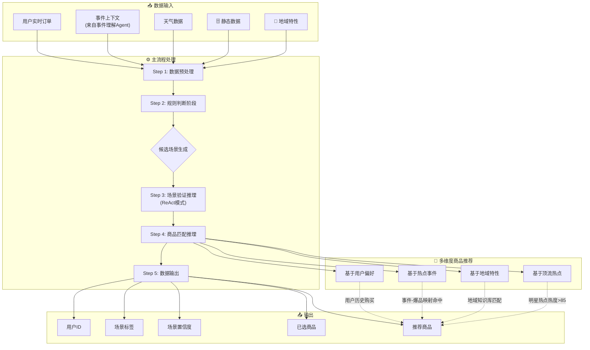
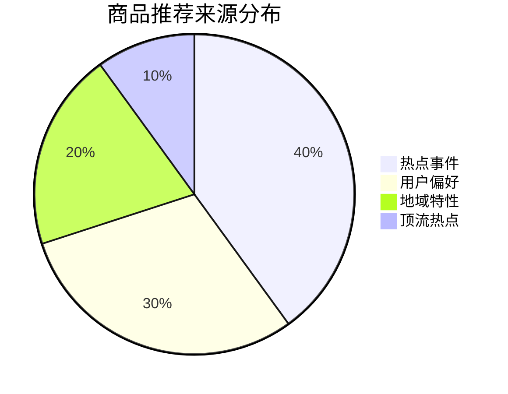

以下是用户情绪/场景分析Agent的标准操作流程（SOP）：

## 数据输入规范

系统需接收并整合以下用户及环境信息：

| 数据类别 | 数据类型 | 更新频率 | 说明 |
|---------|---------|---------|------|
| 实时数据 | 用户实时订单数据 | 实时 | 商品品类、数量、价格等详细信息 |
| 实时数据 | 环境数据 | 实时 | 事件信息、天气预报数据 |
| 静态数据 | 用户画像标签 | 月/季度更新 | 用户偏好标签、消费能力等级等 |
| 静态数据 | 地域特性映射 | 季度更新 | 城市-节日-商品对应关系 |
| 静态数据 | 事件-爆品映射 | 月度更新 | 热点事件与爆品的关联关系 |
| 实时数据 | 时间信息 | 实时 | 精确至小时，区分工作日/周末/节假日 |

---

## 主流程执行逻辑

### Step 1 - 数据预处理

**核心原则**：静态数据与动态数据分离处理，避免每日重复计算

- **动态数据实时获取**：
  - 用户实时订单数据（商品品类、数量、价格）
  - 当前事件列表（来自事件理解Agent输出）
  - 天气预报及实时天气数据
  - 当前时段（工作日/周末/节假日）

- **静态数据按需调用**：
  - 用户画像标签（按用户ID查询，无需每日全量计算）
  - 事件-爆品映射关系（通过事件类型匹配）
  - 地域特性映射（通过用户所在地匹配）

- **数据整合策略**：
  ```json
  {
    "用户ID": "xxx",
    "实时订单": [...],
    "事件上下文": {
      "事件类型": "赛事/娱乐/天气/节日",
      "事件热度": 85,
      "匹配商品品类": ["啤酒", "炸鸡"]
    },
    "用户画像": {
      "偏好标签": ["零食爱好者", "足球迷"],
      "消费能力": "中"
    },
    "地域特性": {
      "城市": "重庆",
      "节日偏好": ["小龙虾", "冰啤"]
    },
    "时间": "2024-06-15 22:00",
    "时段": "周末"
  }
  ```

### Step 2 - 规则判断阶段

执行预设规则引擎，基于动态数据进行场景初步匹配：

**多维度规则体系**：

| 场景类型 | 触发条件 | 优先级 |
|---------|---------|--------|
| 看球 | 订单包含啤酒+零食 + 赛事事件 + 体育热点 | 高 |
| 加班 | 订单包含泡面+提神饮品 + 工作日 + 写字楼区域 | 高 |
| 聚会 | 订单包含多种酒水 + 周末/节假日 + 大份量 | 高 |
| 独饮 | 订单包含单一酒水 + 深夜时段 + 小份量 | 中 |
| 零食 | 订单包含膨化食品+饮料 + 无特定时间规律 | 中 |
| 节日特供 | 当前节日 + 地域特性匹配 | 高 |

**规则执行要求**：
- 支持多规则并行判断，可生成多个候选场景
- 规则引擎需具备可配置性，支持新增、修改、删除规则条件
- 规则条件需结合静态数据进行增强（如用户画像、地域特性）

### Step 3 - 场景验证与推理阶段（ReAct模式）

调用大模型A对候选场景进行处理：

**核心任务**：
- 验证各候选场景的合理性与匹配度
- 基于多维度数据进行综合推理（事件热度+用户画像+地域特性）
- 确定最终场景标签

**输入数据融合策略**：
```json
{
  "用户当前订单": ["啤酒", "薯片"],
  "事件上下文": {
    "类型": "赛事",
    "热度": 92,
    "匹配商品": ["啤酒", "炸鸡", "零食"]
  },
  "用户画像": {
    "偏好": ["足球", "零食"],
    "历史购买": ["啤酒", "坚果"]
  },
  "地域特性": {
    "城市": "重庆",
    "特殊需求": ["小龙虾", "冰啤"]
  }
}
```

**输出格式**：
- 包含唯一场景标签的结构化用户信息
- 场景标签符合预定义的场景分类体系
- 若信息不足导致场景判断不确定，生成信息澄清请求

### Step 4 - 商品匹配推理阶段

调用大模型B处理含场景标签的用户信息：

**多维度商品推荐策略**：

1. **基于用户偏好的推荐**：
   - 优先推荐用户历史购买过的同品类商品
   - 结合用户画像标签进行个性化推荐

2. **基于热点事件的推荐**：
   - 直接引用事件-爆品映射关系中的商品
   - 热度>90的事件商品自动提升为高优先级

3. **基于地域特性的推荐**：
   - 结合用户所在地，从**连锁商超地域知识库**获取推荐商品
   - 地域维度：**商超品牌 + 城市 + 定位**的多维度组合
   - 示例：
     - 华润万家_成都_夏季：推荐小龙虾、冰啤、串串
     - 永辉超市_重庆_夏季：推荐小龙虾、火锅食材、冰啤
     - 盒马鲜生_上海_深夜：推荐泡饭、小馄饨、葱油拌面
     - 山姆会员店_全国_节假日：推荐进口零食、红酒、坚果礼盒

   **连锁商超品牌知识库**：

   | 商超品牌 | 定位 | 核心城市 | 夜宵特色商品 |
   |---------|------|---------|------------|
   | **华润万家** | 平价大众 | 珠三角、长三角、京津 | 应季水果、啤酒、零食、速冻食品 |
   | **永辉超市** | 平价大众 | 福建、重庆、四川 | 火锅食材、小龙虾、卤味 |
   | **大润发** | 平价大众 | 全国覆盖 | 传统零食、啤酒、应季商品 |
   | **盒马鲜生** | 中高端 | 一线城市、新一线 | 进口商品、海鲜、精致小食 |
   | **山姆会员店** | 高端 | 一线城市、新一线 | 进口零食、红酒、坚果、烘焙 |
   | **家家悦** | 平价 | 山东、东北 | 海鲜、卤味、啤酒 |
   | **红旗连锁** | 社区便利 | 四川 | 串串、卤味、冷淡杯 |
   | **美宜佳** | 社区便利 | 广东 | 广式点心、糖水、烧味 |

   **城市-商超-季节三维知识库**：

   ```json
   {
     "商超品牌": "华润万家",
     "城市": "成都",
     "季节/节日": "夏季",
     "推荐商品品类": ["小龙虾", "冰啤", "串串", "冷淡杯", "卤味", "凉菜"],
     "优先级": "高",
     "参考因素": "成都夏季高温+夜生活丰富+华润门店覆盖面广"
   }
   ```

   ```json
   {
     "商超品牌": "盒马鲜生",
     "城市": "上海",
     "季节/节日": "深夜时段(22:00-02:00)",
     "推荐商品品类": ["泡饭", "小馄饨", "葱油拌面", "进口零食", "啤酒"],
     "优先级": "高",
     "参考因素": "上海夜宵文化精致化+盒马即时配送能力"
   }
   ```

   ```json
   {
     "商超品牌": "山姆会员店",
     "城市": "全国",
     "季节/节日": "国庆节/春节",
     "推荐商品品类": ["进口坚果礼盒", "红酒", "进口零食大礼包", "烘焙甜点", "车厘子"],
     "优先级": "高",
     "参考因素": "高端客群+节日送礼需求+家庭聚会场景"
   }
   ```

4. **基于顶流热点的新品推荐**：
   - 若事件包含明星推荐、顶流热点，即使无历史购买数据也纳入推荐
   - 触发条件：事件类型为"明星热点"且热度>85

**输出格式**：
```json
{
  "商品ID": "xxx",
  "推荐优先级": "高/中/低",
  "推荐来源": "用户偏好/热点事件/地域特性/顶流推荐",
  "匹配理由": "基于xxx场景推荐"
}
```

### Step 5 - 数据输出阶段

按照小时为单位进行时间分层处理：

**输出数据结构**：
```json
{
  "用户ID": "xxx",
  "场景": "看球/加班/聚会/独饮/零食/节日特供/其他",
  "原因": "导致场景判断的关键因素",
  "场景置信度": 0.92,
  "已选商品": ["商品ID列表"],
  "推荐商品": [
    {
      "商品ID": "xxx",
      "优先级": "高",
      "来源": "热点事件",
      "理由": "世界杯赛事带动"
    }
  ],
  "时间": "2024-06-15 22:00",
  "所在地": "重庆",
  "相关事件": {
    "事件名": "欧洲杯决赛",
    "热度": 92,
    "类型": "赛事"
  }
}
```

---

## 多维度爆品逻辑支持

### 爆品来源维度

| 爆品类型 | 定义 | 触发条件 | 推荐优先级 |
|---------|------|---------|-----------|
| 历史爆品 | 用户历史多次购买的高销量商品 | 用户历史购买频次≥3 | 中 |
| 热点爆品 | 受热点事件驱动的热门商品 | 事件热度>80 + 事件-爆品映射命中 | 高 |
| 地域爆品 | 特定地域的特色畅销商品 | 地域特性匹配 + 城市销量排名Top20 | 中 |
| 顶流爆品 | 受明星/KOL推荐的新晋热门商品 | 事件类型为"明星热点" + 热度>85 | 高 |
| 趋势爆品 | 近期销量快速增长的商品 | 近7天销量增长>50% | 中 |

### 平台差异化支持

**美团（即时零售）**：
- 地域精度：按商家周边3公里范围
- 推荐商品需考虑库存可用性
- 时间窗口：未来24小时

**淘宝（电商）**：
- 地域精度：按省份/城市
- 推荐商品需考虑物流时效
- 时间窗口：未来5天
- 需提前预测事件以应对物流周期

---

## 执行要求

| 要求项 | 标准 |
|-------|------|
| 处理延迟 | ≤5秒/用户 |
| 场景判断准确率 | ≥85% |
| 异常处理 | 缺失数据或模型调用失败需有明确应对策略 |
| 日志记录 | 所有决策过程需保留可追溯日志 |
| 效果评估 | 定期对规则引擎和模型推理结果进行评估与优化 |

---

## 场景分类体系

| 场景标签 | 定义 | 典型时段 | 典型商品 |
|---------|------|---------|---------|
| 看球 | 体育赛事期间 | 赛事期间 | 啤酒、零食、炸鸡 |
| 加班 | 工作日晚间加班 | 工作日22:00后 | 泡面、提神饮品 |
| 聚会 | 多人社交聚会 | 周末、节假日 | 多种酒水、零食、大份量 |
| 独饮 | 独自饮酒放松 | 深夜时段 | 单一酒水、小份量 |
| 零食 | 随意零食消费 | 无特定规律 | 膨化食品、饮料 |
| 节日特供 | 节日特色需求 | 节日期间 | 节日特色商品 |
| 其他 | 无法归类的场景 | - | 基于画像推荐 |

---

## 流程图



### 流程图说明

| 阶段 | 关键节点 | 说明 |
|------|---------|------|
| **数据预处理** | Step 1 | 整合动态数据（订单/事件/天气）+ 按需调用静态数据（画像/映射/地域） |
| **规则判断** | Step 2 | 基于预设规则引擎初步匹配场景 |
| **场景验证** | Step 3 | 大模型A综合推理，确定最终场景标签 |
| **商品匹配** | Step 4 | 大模型B基于4个维度推理推荐商品 |
| **数据输出** | Step 5 | 按小时为单位输出结构化用户场景信息 |

### 多维度商品推荐权重



| 推荐来源 | 权重 | 触发条件 |
|---------|------|---------|
| 热点事件 | 40% | 事件热度>80 + 映射命中 |
| 用户偏好 | 30% | 用户历史购买频次≥3 |
| 地域特性 | 20% | 城市匹配 + 销量Top20 |
| 顶流热点 | 10% | 明星热点 + 热度>85 |