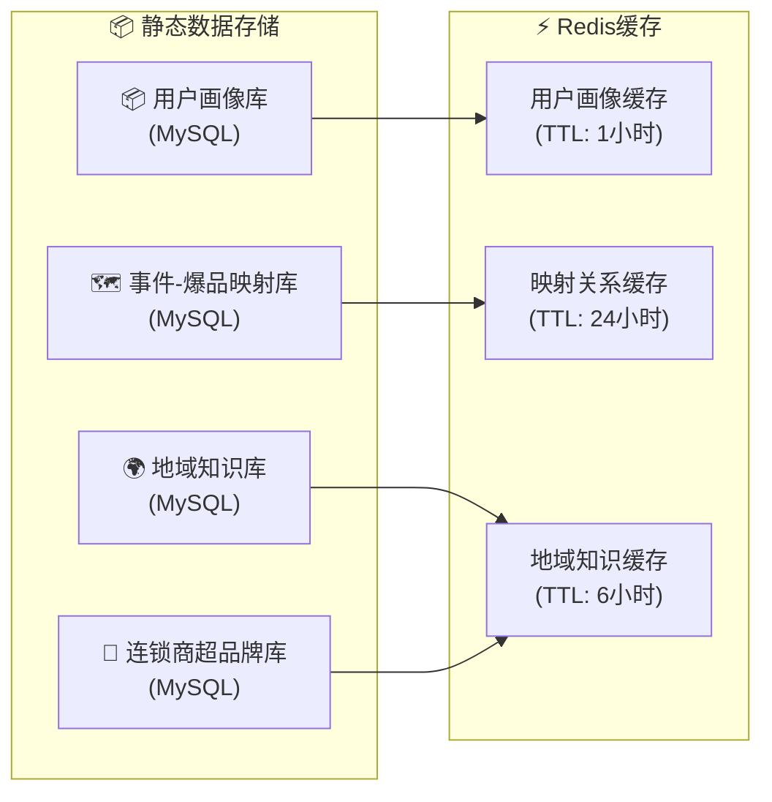
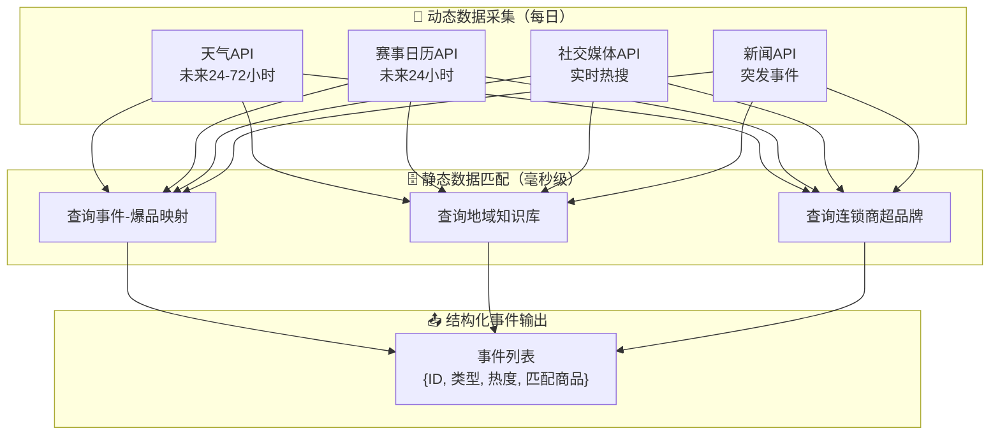

# AI夜宵爆品预测助手 - 技术需求文档（TRD）

## 文档信息

| 属性 | 内容 |
|------|------|
| 产品名称 | AI夜宵爆品预测助手 |
| 文档版本 | V2.0 |
| 编订日期 | 2026-03-22 |
| 更新说明 | V2.0: 优化静态动态数据分离、多维度爆品识别、平台差异化支持、连锁商超地域知识库 |
| 关联文档 | PRD.md（产品需求文档 V2.0）|

---

## 1. 技术架构概述

### 1.1 系统架构图

```
┌─────────────────────────────────────────────────────────────────────────────────┐
│                              前端展示层                                          │
│  ┌─────────────────┐  ┌─────────────────┐  ┌─────────────────┐               │
│  │   商家工作台     │  │   运营后台       │  │   数据报表       │               │
│  │   (Web/H5)      │  │   (Web)         │  │   (Web)         │               │
│  └────────┬────────┘  └────────┬────────┘  └────────┬────────┘               │
└───────────┼────────────────────┼────────────────────┼────────────────────────┘
            │                    │                    │
            └────────────────────┼────────────────────┘
                                 │ HTTPS + REST API
┌────────────────────────────────┼──────────────────────────────────────────────┐
│                              BFF层（Backend For Frontend）                      │
│  ┌─────────────────────────────────────────────────────────────────────────┐   │
│  │                           API Gateway / BFF                              │   │
│  │   - 路由转发  - 认证鉴权  - 请求校验  - 限流熔断  - 日志记录            │   │
│  └─────────────────────────────────────────────────────────────────────────┘   │
└───────────────────────────────────────┬──────────────────────────────────────┘
                                        │
┌───────────────────────────────────────┼──────────────────────────────────────┐
│                                      │         服务层                         │
│  ┌──────────────────────────────────┴──────────────────────────────────┐     │
│  │                        事件理解分析服务                                │     │
│  │  ┌──────────────┐  ┌──────────────┐  ┌──────────────┐  ┌──────────┐ │     │
│  │  │ 数据采集模块  │→│ 事件分类模块  │→│ 去重合并模块 │→│ 热度计算  │ │     │
│  │  │              │  │  (LLM)        │  │              │  │          │ │     │
│  │  └──────────────┘  └──────────────┘  └──────────────┘  └──────────┘ │     │
│  └─────────────────────────────────────────────────────────────────────┘     │
│                                       ↓                                        │
│  ┌─────────────────────────────────────────────────────────────────────────┐   │
│  │                      用户场景分析服务                                    │     │
│  │  ┌──────────────┐  ┌──────────────┐  ┌──────────────┐  ┌──────────┐ │     │
│  │  │ 规则引擎模块  │→│ 场景推理模块  │→│ 商品匹配模块  │→│ 结果输出  │ │     │
│  │  │  (Rule Engine)│ │  (LLM-A)     │  │  (LLM-B)     │  │          │ │     │
│  │  └──────────────┘  └──────────────┘  └──────────────┘  └──────────┘ │     │
│  └─────────────────────────────────────────────────────────────────────┘     │
│                                       ↓                                        │
│  ┌─────────────────────────────────────────────────────────────────────────┐   │
│  │                        决策服务层                                        │     │
│  │  ┌──────────────┐  ┌──────────────┐  ┌──────────────┐  ┌──────────┐ │     │
│  │  │ 候选组合生成  │→│ 销量预测模块  │→│ 补货计算模块  │→│ 智能定价  │ │     │
│  │  │              │  │ (ML Model)   │  │              │  │ (LLM)    │ │     │
│  │  └──────────────┘  └──────────────┘  └──────────────┘  └──────────┘ │     │
│  └─────────────────────────────────────────────────────────────────────┘     │
│                                       ↓                                        │
│  ┌─────────────────────────────────────────────────────────────────────────┐   │
│  │                        数据服务层                                        │     │
│  │  ┌──────────────┐  ┌──────────────┐  ┌──────────────┐  ┌──────────┐ │     │
│  │  │ 事件数据服务  │  │ 用户数据服务  │  │ 商家数据服务  │  │ 决策存储  │ │     │
│  │  └──────────────┘  └──────────────┘  └──────────────┘  └──────────┘ │     │
│  └─────────────────────────────────────────────────────────────────────┘     │
└───────────────────────────────────────────────────────────────────────────────┘
                                        │
┌────────────────────────────────────────┼──────────────────────────────────────┐
│                                        │           数据存储层                  │
│  ┌─────────────────────────────────────┴─────────────────────────────────┐     │
│  │                            MySQL 8.0                                    │     │
│  │  - 商家信息  - 商品品类  - 库存数据  - 订单记录  - 决策结果  - 用户画像 │     │
│  │  - 事件原始数据（JSON字段）  - LLM调用日志  - 复核记录                  │     │
│  └────────────────────────────────────────────────────────────────────────┘     │
│                                       │                                       │
│  ┌─────────────────────────────────────┴─────────────────────────────────┐     │
│  │                            Redis 7.0                                    │     │
│  │  - 事件热度缓存  - LLM调用缓存  - Session管理  - 实时排名              │     │
│  └────────────────────────────────────────────────────────────────────────┘     │
└───────────────────────────────────────────────────────────────────────────────┘
                                        │
┌────────────────────────────────────────┼──────────────────────────────────────┐
│                                        │           外部数据源                  │
│  ┌──────────────────┐ ┌──────────────┐ ┌──────────────┐ ┌──────────────────┐     │
│  │   天气API         │ │  赛事API      │ │ 社交媒体API  │ │   商家平台API     │     │
│  │  (和风/心知)      │ │ (球探/雷速)  │ │ (微博/抖音)  │ │  (美团/饿了么)   │     │
│  └──────────────────┘ └──────────────┘ └──────────────┘ └──────────────────┘     │
└───────────────────────────────────────────────────────────────────────────────┘
```

### 1.2 技术架构原则

| 原则 | 说明 |
|------|------|
| 模块化设计 | 各Agent独立部署，支持独立扩展和灰度发布 |
| 数据解耦 | Agent间通过标准JSON格式通信，不直接共享状态 |
| 可插拔 | LLM模块、ML模型、规则引擎均支持热插拔 |
| 可观测 | 全链路日志、Metrics、Trace，链路追踪到每个Agent |
| 容错设计 | 任何单点故障不影响整体系统可用性 |
| **静态动态分离** | 避免每日重复计算历史数据，节省TOKEN消耗80%+ |
| **多维度爆品** | 突破单一用户偏好，整合热点事件、地域特性、顶流推荐 |
| **平台差异化** | 兼容美团（24小时即时零售）vs 淘宝（5天电商物流） |

---

### 1.3 数据架构规范（核心优化）

#### 1.3.1 数据分类原则

| 数据类型 | 定义 | 更新频率 | 示例 | 存储位置 |
|---------|------|---------|------|---------|
| **静态数据** | 历史积累的稳定映射关系 | 月/季度更新 | 用户偏好标签、事件-爆品对应关系、地域饮食特性 | MySQL + Redis缓存 |
| **动态数据** | 每日实时获取的外部事件 | 每日获取 | 天气预报、赛事日历、社交媒体热点、突发新闻 | MySQL + Redis实时 |

#### 1.3.2 数据分离优势

| 优化项 | 原方案（未分离） | 新方案（分离后） | 优化效果 |
|--------|----------------|----------------|---------|
| TOKEN消耗 | 每日重复分析历史订单 | 仅查询静态映射表 | **节省80%+ TOKEN** |
| 计算延迟 | 全量历史分析耗时 | 静态映射匹配毫秒级 | **提升50倍+** |
| 数据更新 | 实时更新困难 | 月/季度批量更新 | 维护成本降低 |
| 可扩展性 | 耦合度高 | 解耦，便于扩展 | 支持新维度新增 |

#### 1.3.3 静态数据结构设计



**静态数据表设计**：

```sql
-- 事件-爆品映射表（月度更新）
CREATE TABLE event_product_mapping (
    id BIGINT PRIMARY KEY AUTO_INCREMENT,
    event_type VARCHAR(32) NOT NULL,
    event_keywords JSON,
    product_categories JSON,
    priority INT DEFAULT 1,
    effect_start DATE,
    effect_end DATE,
    region_scope VARCHAR(64) DEFAULT '全国',
    last_updated DATETIME DEFAULT CURRENT_TIMESTAMP ON UPDATE CURRENT_TIMESTAMP,
    
    INDEX idx_event_type (event_type),
    INDEX idx_region (region_scope)
);

-- 地域知识库（季度更新）
CREATE TABLE region_knowledge (
    id BIGINT PRIMARY KEY AUTO_INCREMENT,
    region_type ENUM('城市', '省份', '全国') NOT NULL,
    region_name VARCHAR(64) NOT NULL,
    chain_brand VARCHAR(64),
    season_or_festival VARCHAR(64),
    recommended_categories JSON,
    priority INT DEFAULT 1,
    last_updated DATETIME DEFAULT CURRENT_TIMESTAMP ON UPDATE CURRENT_TIMESTAMP,
    
    INDEX idx_region_name (region_name),
    INDEX idx_brand (chain_brand)
);

-- 连锁商超品牌知识库（季度更新）
CREATE TABLE chain_brand_knowledge (
    id BIGINT PRIMARY KEY AUTO_INCREMENT,
    brand_name VARCHAR(64) NOT NULL,
    brand_level ENUM('高端', '中高端', '平价', '社区便利') NOT NULL,
    core_cities JSON,
    night_snack_categories JSON,
    target_customer VARCHAR(128),
    last_updated DATETIME DEFAULT CURRENT_TIMESTAMP ON UPDATE CURRENT_TIMESTAMP,
    
    INDEX idx_brand_level (brand_level)
);
```

#### 1.3.4 动态数据处理流程



**动态数据表设计**：

```sql
-- 事件原始数据表（每日新增）
CREATE TABLE events_dynamic (
    id BIGINT PRIMARY KEY AUTO_INCREMENT,
    event_id VARCHAR(32) UNIQUE NOT NULL,
    event_name VARCHAR(255) NOT NULL,
    event_type ENUM('赛事', '娱乐', '天气', '节日', '明星热点', '社会', '其他') NOT NULL,
    event_time DATETIME NOT NULL,
    event_location VARCHAR(255),
    event_heat DECIMAL(5,2) DEFAULT 0,
    source_platform VARCHAR(32),
    raw_data JSON,
    confidence DECIMAL(5,2),
    needs_review TINYINT(1) DEFAULT 0,
    created_at DATETIME DEFAULT CURRENT_TIMESTAMP,
    
    INDEX idx_event_type (event_type),
    INDEX idx_event_time (event_time),
    INDEX idx_event_heat (event_heat)
);
```

---

## 2. 技术选型

### 2.1 核心框架

| 组件 | 技术选型 | 版本 | 说明 |
|------|---------|------|------|
| 后端框架 | FastAPI | 0.109+ | 高性能异步框架，支持自动API文档 |
| 异步任务 | Celery + Redis | 5.3+ | 分布式任务队列，支持定时任务 |
| 微服务框架 | 暂无 | - | MVP阶段单体部署，后续可拆分 |
| Python版本 | Python | 3.11+ | 优先特性支持 |

### 2.2 数据存储

| 存储 | 技术选型 | 版本 | 说明 |
|------|---------|------|------|
| 关系型数据库 | MySQL | 8.0 | 核心业务数据存储（商家、商品、库存、订单、决策等） |
| 缓存 | Redis | 7.0 | 事件热度缓存、LLM调用缓存、Session管理、实时排名 |

### 2.3 机器学习/AI

| 组件 | 技术选型 | 说明 |
|------|---------|------|
| LLM框架 | LangChain | 统一调用接口，支持多模型切换 |
| LLM模型 | MiniMax-Text-01 | MiniMax API |
| Embedding | MiniMax-Embeddings | 语义匹配、相似度计算 |
| 时序预测 | Prophet / NeuralProphet | 销量预测模型 |
| 特征工程 | pandas + scikit-learn | 数据处理、特征提取 |

### 2.4 大模型配置

所有Agent的大模型配置统一在 `config/llm_config.yaml` 中管理，便于配置切换和成本控制。

#### 2.4.1 配置结构

```yaml
# config/llm_config.yaml
minimax:
  api_key: ${MINIMAX_API_KEY}        # 环境变量引入
  api_base: "https://api.minimax.chat/v1"

  # 各Agent的模型配置
  agents:
    # 事件分类 - 理解要求高，用主力模型
    event_classifier:
      model: "MiniMax-Text-01"
      temperature: 0.3
      max_tokens: 500
      timeout: 10

    # 场景推理 - 复杂推理，用主力模型
    scene_inference:
      model: "MiniMax-Text-01"
      temperature: 0.5
      max_tokens: 800
      timeout: 15

    # 商品匹配 - 相对简单，可用轻量版降本
    product_matcher:
      model: "MiniMax-Text-01-flash"
      temperature: 0.3
      max_tokens: 600
      timeout: 8

    # 智能定价 - 商业决策，需准确
    pricing_engine:
      model: "MiniMax-Text-01"
      temperature: 0.2
      max_tokens: 1000
      timeout: 12

  # Embedding 配置
  embedding:
    model: "MiniMax-Embeddings"
    dimension: 1536

  # 降级策略
  fallback:
    enabled: true
    models:
      - model: "MiniMax-Text-01"
        weight: 0.7
      - model: "MiniMax-Text-01-flash"
        weight: 0.3

  # 缓存策略
  cache:
    enabled: true
    ttl: 3600          # 缓存有效期（秒）
    max_size: 10000    # 最大缓存条数

  # 限流配置
  rate_limit:
    max_requests_per_minute: 60
    max_tokens_per_minute: 100000

  # 熔断配置
  circuit_breaker:
    failure_threshold: 5      # 失败次数阈值
    recovery_timeout: 60     # 恢复时间（秒）
```

#### 2.4.2 配置加载器

```python
# src/ml/llm/config_loader.py
import yaml
from pathlib import Path
from functools import lru_cache

class LLMConfigLoader:
    _instance = None

    def __new__(cls):
        if cls._instance is None:
            cls._instance = super().__new__(cls)
            cls._instance._load_config()
        return cls._instance

    def _load_config(self):
        config_path = Path(__file__).parent.parent.parent / "config" / "llm_config.yaml"
        with open(config_path, "r", encoding="utf-8") as f:
            self._config = yaml.safe_load(f)

    def get_agent_config(self, agent_name: str) -> dict:
        return self._config["minimax"]["agents"].get(agent_name, {})

    def get_embedding_config(self) -> dict:
        return self._config["minimax"]["embedding"]

    def get_fallback_config(self) -> list:
        return self._config["minimax"]["fallback"].get("models", [])

    def is_cache_enabled(self) -> bool:
        return self._config["minimax"]["cache"]["enabled"]

    def get_cache_ttl(self) -> int:
        return self._config["minimax"]["cache"]["ttl"]

@lru_cache()
def get_llm_config() -> LLMConfigLoader:
    return LLMConfigLoader()
```

#### 2.4.3 各Agent模型分配

| Agent | 模块 | 使用模型 | 理由 |
|-------|------|---------|------|
| 事件理解分析Agent | 事件分类 | MiniMax-Text-01 | 结构化分类，理解要求高 |
| 用户场景分析Agent | 场景推理 | MiniMax-Text-01 | 复杂推理，需强理解能力 |
| 用户场景分析Agent | 商品匹配 | MiniMax-Text-01-flash | 匹配相对简单，轻量版降本 |
| 决策Agent | 智能定价 | MiniMax-Text-01 | 涉及商业决策，需准确 |

---

## 3. 模块详细设计

### 3.1 事件理解分析服务

#### 3.1.1 模块架构

```
事件理解分析服务
│
├── data_collector/              # 数据采集模块
│   ├── __init__.py
│   ├── weather_collector.py     # 天气数据采集
│   ├── sports_collector.py      # 赛事数据采集
│   ├── social_media_collector.py # 社交媒体采集
│   └── normalizer.py            # 数据格式标准化
│
├── event_classifier/            # 事件分类模块
│   ├── __init__.py
│   ├── classifier.py             # LLM分类器
│   ├── prompt_templates.py      # 分类Prompt模板
│   └── confidence_checker.py    # 置信度检查
│
├── event_dedup/                 # 去重合并模块
│   ├── __init__.py
│   ├── dedup_engine.py          # 去重引擎
│   ├── merger.py                # 事件合并
│   └── event_registry.py        # 事件注册表
│
├── heat_calculator/             # 热度计算模块
│   ├── __init__.py
│   ├── calculator.py             # 热度计算
│   └── scorer.py                # 评分器
│
└── main.py                      # 服务入口
```

#### 3.1.2 核心类设计

**EventCollector（数据采集）**

```python
class EventCollector:
    def __init__(self, source_name: str, api_config: dict):
        self.source_name = source_name
        self.api_config = api_config
        self.raw_data_store = MySQLTable("raw_events")

    async def collect(self, time_range: tuple[datetime, datetime]) -> list[dict]:
        raise NotImplementedError

    async def normalize(self, raw_event: dict) -> dict:
        return {
            "event_id": self._generate_event_id(raw_event),
            "source": self.source_name,
            "raw_content": json.dumps(raw_event, ensure_ascii=False),
            "collected_at": datetime.now(),
            "status": "pending"
        }

    def _generate_event_id(self, raw_event: dict) -> str:
        content = f"{raw_event.get('name', '')}{raw_event.get('time', '')}"
        return hashlib.md5(content.encode()).hexdigest()[:16]
```

**EventClassifier（事件分类）**

```python
class EventClassifier:
    CLASSIFICATION_PROMPT = """
你是一个事件分类专家。请根据以下事件信息，判断其类型。

事件信息：
- 事件名称：{event_name}
- 事件摘要：{event_summary}
- 发生时间：{event_time}
- 发生地点：{event_location}

分类选项：
- 赛事：体育比赛相关事件
- 娱乐：影视、音乐、综艺等娱乐事件
- 天气：天气相关事件
- 社会：社会新闻、热点事件
- 其他：不属于以上类别的事件

请输出JSON格式的分类结果：
{{
    "category": "分类名称",
    "confidence": 0.0-1.0的置信度,
    "reasoning": "分类理由"
}}
"""

    def __init__(self, llm_client: LangChainLLM):
        self.llm = llm_client
        self.category_rules = self._load_category_rules()

    async def classify(self, event: dict) -> dict:
        prompt = self.CLASSIFICATION_PROMPT.format(
            event_name=event.get("name", ""),
            event_summary=event.get("summary", ""),
            event_time=event.get("time", ""),
            event_location=event.get("location", "")
        )
        response = await self.llm.agenerate([prompt])
        result = self._parse_response(response)

        if result["confidence"] < 0.7:
            result["needs_review"] = True
            await self._send_to_review_queue(event, result)

        return result

**EventDedup（语义去重引擎）**

```python
from sklearn.feature_extraction.text import TfidfVectorizer
from sklearn.metrics.pairwise import cosine_similarity
import numpy as np

class EventDedup:
    def __init__(self, similarity_threshold: float = 0.85):
        self.similarity_threshold = similarity_threshold
        self.vectorizer = TfidfVectorizer()
        self.event_index = []
        self.vector_index = None

    async def process(self, events: list[dict]) -> list[dict]:
        if not events:
            return []

        processed = []
        new_events = []

        for event in events:
            if await self._is_duplicate(event):
                await self._merge_to_existing(event)
            else:
                new_events.append(event)
                processed.append(event)

        if new_events:
            await self._update_index(new_events)

        return processed

    async def _is_duplicate(self, event: dict) -> bool:
        if not self.event_index:
            return False

        event_text = self._get_event_text(event)
        event_vector = self.vectorizer.transform([event_text])

        similarities = cosine_similarity(event_vector, self.vector_index)[0]
        max_similarity = float(np.max(similarities))

        return max_similarity >= self.similarity_threshold

    async def _merge_to_existing(self, event: dict):
        pass

    def _get_event_text(self, event: dict) -> str:
        return f"{event.get('name', '')} {event.get('summary', '')}"

    async def _update_index(self, new_events: list[dict]):
        texts = [self._get_event_text(e) for e in new_events]
        new_vectors = self.vectorizer.fit_transform(texts)

        if self.vector_index is None:
            self.vector_index = new_vectors
        else:
            self.vector_index = np.vstack([self.vector_index.toarray(), new_vectors.toarray()])

        self.event_index.extend(new_events)
```

**HeatCalculator（热度计算）**

```python
class HeatCalculator:
    WEIGHTS = {"view_count": 0.4, "click_count": 0.6}
    DECAY_CONFIG = {"half_life_hours": 6, "base_decay": 0.95}

    def __init__(self, redis_client: Redis):
        self.redis = redis_client

    def calculate(self, event: dict) -> float:
        view_count = event.get("view_count", 0)
        click_count = event.get("click_count", 0)
        raw_heat = (view_count * self.WEIGHTS["view_count"] +
                   click_count * self.WEIGHTS["click_count"])
        normalized_heat = self._normalize(raw_heat)
        age_hours = self._get_event_age_hours(event)
        decayed_heat = self._apply_decay(normalized_heat, age_hours)
        return round(decayed_heat, 2)

    def _normalize(self, raw_heat: float) -> float:
        import math
        log_heat = math.log1p(raw_heat)
        max_log = math.log1p(1000000)
        return min(100, (log_heat / max_log) * 100)

    def _apply_decay(self, heat: float, age_hours: float) -> float:
        decay_factor = pow(self.DECAY_CONFIG["base_decay"],
                          age_hours / self.DECAY_CONFIG["half_life_hours"])
        return heat * decay_factor
```

#### 3.1.3 数据模型

**事件结构化数据（MySQL）**

```sql
CREATE TABLE events (
    id BIGINT PRIMARY KEY AUTO_INCREMENT,
    event_id VARCHAR(32) UNIQUE NOT NULL,
    event_name VARCHAR(255) NOT NULL,
    event_type ENUM('赛事', '娱乐', '天气', '社会', '其他') NOT NULL,
    event_time DATETIME NOT NULL,
    event_location VARCHAR(255),
    event_heat DECIMAL(5,2) DEFAULT 0,
    heat_rank INT DEFAULT 0,
    summary TEXT,
    entities JSON,
    source_count INT DEFAULT 1,
    sources JSON,
    confidence DECIMAL(5,2),
    needs_review TINYINT(1) DEFAULT 0,
    review_status ENUM('pending', 'approved', 'rejected') DEFAULT NULL,
    reviewed_by VARCHAR(64) DEFAULT NULL,
    reviewed_at DATETIME DEFAULT NULL,
    created_at DATETIME DEFAULT CURRENT_TIMESTAMP,
    updated_at DATETIME DEFAULT CURRENT_TIMESTAMP ON UPDATE CURRENT_TIMESTAMP,

    INDEX idx_event_type (event_type),
    INDEX idx_event_time (event_time),
    INDEX idx_event_heat (event_heat),
    INDEX idx_needs_review (needs_review, review_status)
) ENGINE=InnoDB DEFAULT CHARSET=utf8mb4;
```

#### 3.1.4 置信度低于70%的人工复核流程实现

**复核任务入队**

```python
async def _send_to_review_queue(self, event: dict, classification_result: dict):
    review_task = {
        "event_id": event["event_id"],
        "event_name": event.get("name"),
        "original_classification": classification_result["category"],
        "confidence": classification_result["confidence"],
        "reasoning": classification_result.get("reasoning"),
        "created_at": datetime.now().isoformat(),
        "priority": "high" if event.get("heat", 0) > 90 else "normal"
    }

    await redis_client.zadd(
        "review:queue:pending",
        {json.dumps(review_task): event["heat"]}
    )

    await notification_service.send(
        channel="wechat",
        template="review_notification",
        data=review_task
    )
```

**复核后台API**

```python
# GET /api/v1/admin/review/pending
class ReviewPendingAPI(View):
    async def get(self, request: Request) -> JSONResponse:
        page = int(request.query_params.get("page", 1))
        page_size = int(request.query_params.get("page_size", 20))

        items = await redis_client.zrevrange(
            "review:queue:pending",
            (page - 1) * page_size,
            page * page_size - 1,
            withscores=True
        )
        tasks = [json.loads(item) for item, score in items]

        return JSONResponse({
            "code": 0,
            "data": {
                "items": tasks,
                "total": await redis_client.zcard("review:queue:pending")
            }
        })

# POST /api/v1/admin/review/{event_id}
class ReviewSubmitAPI(View):
    async def post(self, request: Request, event_id: str) -> JSONResponse:
        body = await request.json()
        approved_category = body.get("category")
        operator = body.get("operator")

        await Event.objects.filter(event_id=event_id).update(
            event_type=approved_category,
            review_status="approved",
            reviewed_by=operator,
            reviewed_at=datetime.now(),
            needs_review=False
        )

        await self._remove_from_queue(event_id)

        await OperationLog.objects.create(
            event_id=event_id,
            action="review_approved",
            operator=operator,
            detail=body
        )

        return JSONResponse({"code": 0, "message": "复核成功"})
```

---

### 3.2 用户场景分析服务

#### 3.2.1 模块架构

```
用户场景分析服务
│
├── rule_engine/                  # 规则引擎模块
│   ├── engine.py                 # 规则引擎核心
│   └── rules_config.py           # 规则配置
│
├── scene_inference/              # 场景推理模块
│   ├── inference_engine.py       # LLM推理引擎
│   └── prompt_builder.py         # Prompt构建器
│
├── product_matcher/              # 商品匹配模块
│   ├── matcher.py                # 商品匹配器
│   └── recommender.py            # 推荐生成器
│
└── main.py                      # 服务入口
```

#### 3.2.2 核心类设计

**RuleEngine（规则引擎）**

```python
class RuleEngine:
    SCENE_RULES = {
        "看球": {
            "conditions": [
                {"type": "order_contains", "category": "啤酒"},
                {"type": "order_contains", "category": "零食"},
                {"type": "event_active", "event_type": "赛事"},
                {"type": "time_range", "start": "20:00", "end": "06:00"}
            ],
            "condition_logic": "AND",
            "weight": 0.8
        },
        "加班": {
            "conditions": [
                {"type": "order_contains", "category": "泡面"},
                {"type": "order_contains", "category": "能量饮料"},
                {"type": "location_type", "value": "写字楼"},
                {"type": "is_workday"},
                {"type": "time_range", "start": "20:00", "end": "23:00"}
            ],
            "condition_logic": "AND",
            "weight": 0.75
        },
        "聚会": {
            "conditions": [
                {"type": "order_count", "operator": ">=", "value": 3},
                {"type": "order_contains", "category": "酒水", "count": ">=", 2},
                {"type": "is_weekend_or_holiday"},
                {"type": "order_total_amount", "operator": ">=", "value": 150}
            ],
            "condition_logic": "AND",
            "weight": 0.85
        }
    }

    async def match(self, user_order: dict, user_profile: dict) -> list[dict]:
        candidates = []
        for scene_name, rule in self.SCENE_RULES.items():
            match_result = await self._evaluate_rule(rule, user_order, user_profile)
            if match_result["matched"]:
                candidates.append({
                    "scene": scene_name,
                    "confidence": match_result["confidence"],
                    "matched_conditions": match_result["matched_conditions"],
                    "weight": rule["weight"]
                })
        candidates.sort(key=lambda x: x["confidence"] * x["weight"], reverse=True)
        return candidates[:3]
```

**SceneInference（场景推理）**

```python
class SceneInference:
    SCENE_INFERENCE_PROMPT = """
你是一个用户行为分析专家。根据以下用户信息，判断用户当前最可能的消费场景。

用户订单信息：
- 订单商品：{order_products}
- 订单时间：{order_time}
- 订单金额：{order_amount}

当前环境上下文：
- 天气：{weather}
- 正在发生的事件：{active_events}

候选场景：{candidate_scenes}

请分析以上信息，确定最终场景标签，并输出JSON格式：
{{
    "final_scene": "最终确定的场景",
    "confidence": 0.0-1.0,
    "reasoning": "推理理由"
}}
"""

    async def infer(
        self,
        user_order: dict,
        user_profile: dict,
        candidate_scenes: list[dict],
        event_context: dict
    ) -> dict:
        prompt = self.SCENE_INFERENCE_PROMPT.format(
            order_products=self._format_products(user_order.get("products", [])),
            order_time=user_order.get("order_time"),
            order_amount=user_order.get("total_amount"),
            weather=event_context.get("weather", "未知"),
            active_events=event_context.get("active_events", []),
            candidate_scenes=[s["scene"] for s in candidate_scenes]
        )
        response = await self.llm.agenerate([prompt])
        return self._parse_response(response)
```

#### 3.2.3 数据模型

```sql
CREATE TABLE user_scenes (
    id BIGINT PRIMARY KEY AUTO_INCREMENT,
    scene_id VARCHAR(64) UNIQUE NOT NULL,
    user_id VARCHAR(64) NOT NULL,
    scene_type ENUM('看球', '加班', '聚会', '独饮', '零食', '其他') NOT NULL,
    scene_reason TEXT,
    confidence DECIMAL(5,2),
    key_factors JSON,
    current_products JSON,
    recommended_products JSON,
    event_context JSON,
    order_time DATETIME,
    location VARCHAR(255),
    created_at DATETIME DEFAULT CURRENT_TIMESTAMP,

    INDEX idx_user_id (user_id),
    INDEX idx_scene_type (scene_type),
    INDEX idx_order_time (order_time)
) ENGINE=InnoDB DEFAULT CHARSET=utf8mb4;
```

---

### 3.3 决策服务

#### 3.3.1 多维度爆品识别引擎（核心算法）

**爆品来源矩阵**：

| 爆品类型 | 数据来源 | 识别条件 | 优先级权重 | 说明 |
|---------|---------|---------|---------|------|
| **热点事件爆品** | 事件-爆品映射 | 事件热度>80 + 映射命中 | **40%** | 最核心的爆品来源 |
| **用户偏好爆品** | 用户场景分析 | 用户推荐优先级=高 | **25%** | 基于用户历史行为 |
| **地域特色爆品** | 地域知识库 | 城市匹配 + 历史销量Top20 | **20%** | 基于地域特性 |
| **顶流热点爆品** | 社交媒体 | 事件类型=明星热点 + 热度>85 | **10%** | 明星/KOL带动 |
| **趋势增长爆品** | 销量数据 | 近7天销量增长>50% | **5%** | 近期快速增长 |

**爆品得分计算公式**：

```python
爆品得分 = (
    热点事件得分 × 0.40 +
    用户偏好得分 × 0.25 +
    地域特色得分 × 0.20 +
    顶流热点得分 × 0.10 +
    趋势增长得分 × 0.05
)
```

**各维度得分计算**：

```python
def 计算热点事件得分(事件热度):
    """热点事件得分"""
    if 事件热度 > 80:
        return min(事件热度 / 100, 1.0)  # 归一化到0-1
    return 0

def 计算用户偏好得分(推荐优先级):
    """用户偏好得分"""
    if 推荐优先级 == "高":
        return 1.0
    elif 推荐优先级 == "中":
        return 0.6
    return 0.3

def 计算地域特色得分(城市匹配, 销量排名):
    """地域特色得分"""
    if 城市匹配 and 销量排名 <= 20:
        return 1.0
    elif 城市匹配:
        return 0.5
    return 0

def 计算顶流热点得分(事件类型, 事件热度):
    """顶流热点得分"""
    if 事件类型 == "明星热点" and 事件热度 > 85:
        return 1.0
    return 0

def 计算趋势增长得分(销量增长率):
    """趋势增长得分"""
    if 销量增长率 > 50:
        return 1.0
    elif 销量增长率 > 30:
        return 0.7
    elif 销量增长率 > 10:
        return 0.4
    return 0
```

**阈值判定规则**：

| 得分范围 | 判定 | 处理方式 |
|---------|------|---------|
| **≥70分** | ✅ 纳入爆品清单 | 直接进入爆品清单，推荐商家重点备货 |
| **50-70分** | ⚠️ 进入候选池 | 等待人工确认或二次分析 |
| **<50分** | ❌ 排除 | 不纳入爆品清单 |

**综合得分计算示例**：

```python
# 场景：世界杯决赛期间，成都用户
# 商品：啤酒

# 计算各维度得分
热点事件得分 = min(95/100, 1.0) = 0.95  # 世界杯决赛热度95
用户偏好得分 = 1.0  # 推荐优先级=高
地域特色得分 = 1.0  # 成都 + Top5销量
顶流热点得分 = 0    # 不是明星热点
趋势增长得分 = 1.0  # 增长率80% > 50%

# 计算综合得分
爆品得分 = (
    0.95 × 0.40 +  # 热点事件：0.38
    1.0 × 0.25 +   # 用户偏好：0.25
    1.0 × 0.20 +   # 地域特色：0.20
    0 × 0.10 +     # 顶流热点：0
    1.0 × 0.05     # 趋势增长：0.05
)

爆品得分 = 0.38 + 0.25 + 0.20 + 0 + 0.05 = 0.88
# 判定：88分 ≥ 70分，纳入爆品清单
```

#### 3.3.2 连锁商超地域知识库设计

**地域维度**：商超品牌 + 城市 + 定位的多维度组合

**连锁商超品牌知识库**：

| 商超品牌 | 定位 | 核心城市 | 夜宵特色商品 |
|---------|------|---------|------------|
| **华润万家** | 平价大众 | 珠三角、长三角、京津 | 应季水果、啤酒、零食、速冻食品 |
| **永辉超市** | 平价大众 | 福建、重庆、四川 | 火锅食材、小龙虾、卤味 |
| **大润发** | 平价大众 | 全国覆盖 | 传统零食、啤酒、应季商品 |
| **盒马鲜生** | 中高端 | 一线城市、新一线 | 进口商品、海鲜、精致小食 |
| **山姆会员店** | 高端 | 一线城市、新一线 | 进口零食、红酒、坚果、烘焙 |
| **家家悦** | 平价 | 山东、东北 | 海鲜、卤味、啤酒 |
| **红旗连锁** | 社区便利 | 四川 | 串串、卤味、冷淡杯 |
| **美宜佳** | 社区便利 | 广东 | 广式点心、糖水、烧味 |

**城市-商超-季节三维知识库**：

```python
# 示例数据结构
地域知识库 = [
    {
        "商超品牌": "华润万家",
        "城市": "成都",
        "季节/节日": "夏季",
        "推荐商品品类": ["小龙虾", "冰啤", "串串", "冷淡杯", "卤味", "凉菜"],
        "优先级": "高",
        "参考因素": "成都夏季高温+夜生活丰富+华润门店覆盖面广"
    },
    {
        "商超品牌": "盒马鲜生",
        "城市": "上海",
        "季节/节日": "深夜时段(22:00-02:00)",
        "推荐商品品类": ["泡饭", "小馄饨", "葱油拌面", "进口零食", "啤酒"],
        "优先级": "高",
        "参考因素": "上海夜宵文化精致化+盒马即时配送能力"
    },
    {
        "商超品牌": "山姆会员店",
        "城市": "全国",
        "季节/节日": "国庆节/春节",
        "推荐商品品类": ["进口坚果礼盒", "红酒", "进口零食大礼包", "烘焙甜点", "车厘子"],
        "优先级": "高",
        "参考因素": "高端客群+节日送礼需求+家庭聚会场景"
    }
]
```

**地域知识库查询算法**：

```python
def 查询地域推荐(商超品牌, 城市, 季节或节日):
    """
    三维匹配查询地域推荐商品
    
    Args:
        商超品牌: 连锁商超品牌名称
        城市: 城市名称
        季节或节日: 季节或节日标识
    
    Returns:
        推荐商品品类列表（按优先级排序）
    """
    # 优先级匹配规则
    # 1. 精确匹配：商超+城市+季节
    # 2. 模糊匹配：城市+季节（忽略商超品牌）
    # 3. 默认匹配：全国+季节
    
    # 查询逻辑
    exact_match = 查询精确匹配(商超品牌, 城市, 季节或节日)
    if exact_match:
        return exact_match
    
    city_match = 查询城市匹配(城市, 季节或节日)
    if city_match:
        return city_match
    
    default_match = 查询全国匹配(季节或节日)
    return default_match
```

#### 3.3.3 模块架构

```
决策服务
│
├── candidate_generator/          # 候选组合生成
│   ├── generator.py             # 候选生成器
│   └── filter.py                 # 过滤规则
│
├── sales_predictor/              # 销量预测
│   ├── predictor.py              # 预测器
│   ├── features.py               # 特征工程
│   └── models/                   # 模型存储
│
├── restock_calculator/           # 补货计算
│   ├── calculator.py             # 补货计算器
│   ├── safety_stock.py           # 安全库存
│   └── lead_time.py              # 补货周期
│
├── pricing_engine/               # 智能定价
│   ├── engine.py                 # 定价引擎
│   └── strategy.py               # 定价策略
│
└── main.py                      # 服务入口
```

#### 3.3.2 核心类设计

**CandidateGenerator（候选商品组合生成）**

```python
class CandidateGenerator:
    def __init__(self, merchant_id: str, merchant_db: MerchantDatabase,
                 user_scene_data: list[dict]):
        self.merchant_id = merchant_id
        self.merchant_db = merchant_db
        self.user_scene_data = user_scene_data

    async def generate(self) -> list[dict]:
        potential_needs = self._aggregate_potential_needs()
        historical_top = await self._get_historical_top_sellers()
        seasonal_trending = await self._get_seasonal_trending()
        candidates = self._merge_candidates(potential_needs, historical_top, seasonal_trending)
        candidates = await self._filter_by_inventory(candidates)
        candidates = self._score_and_sort(candidates)
        return candidates[:50]

    def _aggregate_potential_needs(self) -> list[dict]:
        product_scores = defaultdict(lambda: {"score": 0, "sources": []})
        for scene_data in self.user_scene_data:
            for product in scene_data.get("recommended_products", []):
                product_id = product["product_id"]
                product_scores[product_id]["score"] += product.get("priority_score", 0.5)
                product_scores[product_id]["sources"].append(scene_data["scene_id"])
        return [
            {"product_id": pid, "aggregate_score": data["score"],
             "scene_count": len(data["sources"]), "source": "user_potential_needs"}
            for pid, data in product_scores.items()
        ]
```

**SalesPredictor（销量预测）**

```python
class SalesPredictor:
    def __init__(self, model_path: str = None):
        self.model_path = model_path or "./models/sales_predictor"
        self.model = self._load_model()

    def _load_model(self):
        from prophet import Prophet
        model = Prophet(
            yearly_seasonality=False,
            weekly_seasonality=True,
            daily_seasonality=True,
            seasonality_mode='multiplicative',
            growth='linear'
        )
        model.add_seasonality(
            name='night_time',
            period=6,
            fourier_order=3
        )
        return model

    async def predict(self, merchant_id: str, product_ids: list[str],
                     prediction_hours: int = 6) -> dict[str, dict]:
        predictions = {}
        for product_id in product_ids:
            historical_data = await self._get_historical_sales(merchant_id, product_id)
            event_factor = await self._get_event_factor(merchant_id, product_id)
            df = self._prepare_features(historical_data, event_factor)

            future_hours = self._make_future_hours_df(prediction_hours)
            forecast = self.model.predict(future_hours)

            hourly_predictions = self._extract_hourly_predictions(forecast, prediction_hours)

            predictions[product_id] = {
                "predicted_hourly_avg": float(forecast['yhat'].mean()),
                "predicted_hourly": hourly_predictions,
                "confidence_lower": float(forecast['yhat_lower'].mean()),
                "confidence_upper": float(forecast['yhat_upper'].mean()),
                "event_impact_factor": event_factor
            }
        return predictions

    def _make_future_hours_df(self, hours: int) -> pd.DataFrame:
        from datetime import datetime, timedelta
        now = datetime.now()
        dates = [now + timedelta(hours=i) for i in range(hours)]
        return pd.DataFrame({'ds': dates})

    def _extract_hourly_predictions(self, forecast, hours: int) -> dict[int, float]:
        hourly = {}
        for i, row in forecast.iterrows():
            if i < hours:
                hourly[i] = float(row['yhat'])
        return hourly
```

**RestockCalculator（补货计算）**

```python
class RestockCalculator:
    async def calculate(self, merchant_id: str,
                       sales_predictions: dict[str, dict],
                       replenishment_period_hours: int = 24) -> list[dict]:
        recommendations = []
        inventory_data = await self.inventory_service.get_by_merchant(merchant_id)

        for product_id, prediction in sales_predictions.items():
            inv = inventory_data.get(product_id, {})
            current_stock = inv.get("usable_stock", 0)
            safety_stock = await self._calculate_safety_stock(
                product_id, prediction["predicted_daily_avg"])
            predicted_demand = prediction["predicted_daily_avg"] * (replenishment_period_hours / 24)
            recommended_qty = max(0, predicted_demand - current_stock + safety_stock)
            urgency = self._determine_urgency(current_stock, safety_stock, predicted_demand)

            recommendations.append({
                "product_id": product_id,
                "current_stock": current_stock,
                "safety_stock": safety_stock,
                "predicted_demand": round(predicted_demand, 2),
                "recommended_quantity": max(1, int(recommended_qty)),
                "urgency": urgency
            })

        urgency_order = {"critical": 0, "high": 1, "medium": 2, "low": 3}
        recommendations.sort(key=lambda x: (urgency_order[x["urgency"]], -x["recommended_quantity"]))
        return recommendations

    def _determine_urgency(self, current_stock: float, safety_stock: float,
                          predicted_demand: float) -> str:
        coverage_ratio = current_stock / predicted_demand if predicted_demand > 0 else 999
        if current_stock < safety_stock * 0.5 or coverage_ratio < 0.5:
            return "critical"
        elif current_stock < safety_stock or coverage_ratio < 1.0:
            return "high"
        elif coverage_ratio < 1.5:
            return "medium"
        return "low"
```

**PricingEngine（智能定价）**

```python
class PricingEngine:
    PRICING_RULES = {
        "hot_stock_adequate": {
            "condition": lambda p: p["is_hot"] and p["stock_status"] == "充足",
            "strategy": "maintain_or_discount",
            "max_discount": 0.10
        },
        "slow_moving": {
            "condition": lambda p: p["days_in_stock"] > 30,
            "strategy": "clearance",
            "discount": 0.20
        }
    }

    async def generate_pricing(self, merchant_id: str,
                               product_predictions: list[dict]) -> list[dict]:
        pricing_recommendations = []
        for product in product_predictions:
            current_price = await self.merchant_db.get_price(merchant_id, product["product_id"])
            cost_price = await self.merchant_db.get_cost(merchant_id, product["product_id"])
            rule_price = self._apply_rule_pricing(product, current_price, cost_price)
            llm_price = await self._llm_enhanced_pricing(merchant_id, product, rule_price)
            final_price = llm_price if llm_price else rule_price

            pricing_recommendations.append({
                "product_id": product["product_id"],
                "current_price": current_price,
                "recommended_price": round(final_price, 2),
                "adjustment_ratio": f"{((final_price - current_price) / current_price * 100):+.1f}%"
            })
        return pricing_recommendations
```

#### 3.3.3 数据模型

```sql
CREATE TABLE merchant_decisions (
    id BIGINT PRIMARY KEY AUTO_INCREMENT,
    decision_id VARCHAR(64) UNIQUE NOT NULL,
    merchant_id VARCHAR(64) NOT NULL,
    decision_date DATE NOT NULL,
    night_period ENUM('20:00-22:00', '22:00-00:00', '00:00-02:00', '02:00-04:00', '04:00-06:00') NOT NULL,
    hot_products JSON,
    restock_recommendations JSON,
    pricing_recommendations JSON,
    bundle_strategies JSON,
    adoption_status ENUM('pending', 'adopted', 'partial_adopted', 'rejected') DEFAULT 'pending',
    adoption_rate DECIMAL(5,2),
    created_at DATETIME DEFAULT CURRENT_TIMESTAMP,

    INDEX idx_merchant_date (merchant_id, decision_date),
    INDEX idx_adoption_status (adoption_status)
) ENGINE=InnoDB DEFAULT CHARSET=utf8mb4;
```

---

## 4. 数据模型

### 4.1 核心表结构

```sql
CREATE TABLE merchants (
    id BIGINT PRIMARY KEY AUTO_INCREMENT,
    merchant_id VARCHAR(64) UNIQUE NOT NULL,
    merchant_name VARCHAR(128) NOT NULL,
    merchant_type ENUM('便利店', '超市', '闪电仓', '其他') DEFAULT '便利店',
    city VARCHAR(32) NOT NULL,
    district VARCHAR(32),
    location VARCHAR(255),
    address VARCHAR(255),
    latitude DECIMAL(10, 7),
    longitude DECIMAL(10, 7),
    delivery_radius_km DECIMAL(5, 2) DEFAULT 3.0,
    status ENUM('active', 'inactive', 'suspended') DEFAULT 'active',
    created_at DATETIME DEFAULT CURRENT_TIMESTAMP,

    INDEX idx_city_district (city, district)
) ENGINE=InnoDB DEFAULT CHARSET=utf8mb4;

CREATE TABLE users (
    id BIGINT PRIMARY KEY AUTO_INCREMENT,
    user_id VARCHAR(64) UNIQUE NOT NULL,
    nickname VARCHAR(64),
    age_range ENUM('18-25', '26-35', '36-45', '45+'),
    gender ENUM('male', 'female', 'unknown') DEFAULT 'unknown',
    preferences JSON,
    consumption_level ENUM('low', 'medium', 'high') DEFAULT 'medium',
    created_at DATETIME DEFAULT CURRENT_TIMESTAMP
) ENGINE=InnoDB DEFAULT CHARSET=utf8mb4;

CREATE TABLE products (
    id BIGINT PRIMARY KEY AUTO_INCREMENT,
    product_id VARCHAR(64) UNIQUE NOT NULL,
    product_name VARCHAR(128) NOT NULL,
    category_id VARCHAR(32) NOT NULL,
    brand VARCHAR(64),
    unit VARCHAR(16),
    cost_price DECIMAL(10, 2) NOT NULL,
    retail_price DECIMAL(10, 2) NOT NULL,
    status ENUM('active', 'inactive') DEFAULT 'active',
    created_at DATETIME DEFAULT CURRENT_TIMESTAMP,

    INDEX idx_category (category_id)
) ENGINE=InnoDB DEFAULT CHARSET=utf8mb4;

CREATE TABLE inventory_records (
    id BIGINT PRIMARY KEY AUTO_INCREMENT,
    record_id VARCHAR(64) UNIQUE NOT NULL,
    merchant_id VARCHAR(64) NOT NULL,
    product_id VARCHAR(64) NOT NULL,
    warehouse_stock INT DEFAULT 0,
    shelf_stock INT DEFAULT 0,
    usable_stock INT GENERATED ALWAYS AS (warehouse_stock + shelf_stock) STORED,
    safety_stock INT DEFAULT 0,
    stock_status ENUM('充足', '正常', '紧张', '缺货') DEFAULT '正常',
    turnover_rate DECIMAL(5, 2),
    supplier VARCHAR(128),
    lead_time_hours INT DEFAULT 24,
    record_time DATETIME DEFAULT CURRENT_TIMESTAMP,

    INDEX idx_merchant_product (merchant_id, product_id),
    INDEX idx_stock_status (stock_status)
) ENGINE=InnoDB DEFAULT CHARSET=utf8mb4;
```

---

## 5. API接口设计

### 5.1 商家端API

| 接口 | 方法 | 路径 | 说明 |
|------|------|------|------|
| 商家登录 | POST | /api/v1/auth/login | 商家账号登录 |
| 商家信息 | GET | /api/v1/merchant/profile | 获取商家信息 |
| 获取爆品清单 | GET | /api/v1/decision/{date}/hot-products | 获取指定日期爆品清单 |
| 获取补货建议 | GET | /api/v1/decision/{date}/restock | 获取指定日期补货建议 |
| 获取定价建议 | GET | /api/v1/decision/{date}/pricing | 获取指定日期定价建议 |
| 采纳决策 | POST | /api/v1/decision/{decision_id}/adopt | 采纳决策建议 |

### 5.2 运营后台API

| 接口 | 方法 | 路径 | 说明 |
|------|------|------|------|
| 事件列表 | GET | /api/v1/admin/events | 查询事件列表 |
| 待复核事件 | GET | /api/v1/admin/review/pending | 获取待复核事件 |
| 提交复核 | POST | /api/v1/admin/review/{event_id} | 提交复核结果 |
| 商家管理 | GET | /api/v1/admin/merchants | 商家列表 |

### 5.3 数据API

| 接口 | 方法 | 路径 | 说明 |
|------|------|------|------|
| 用户场景分析 | POST | /api/v1/scene/analyze | 分析用户场景 |
| 事件上下文 | GET | /api/v1/events/context | 获取当前事件上下文 |
| 商品推荐 | POST | /api/v1/products/recommend | 商品推荐 |

---

## 6. 非功能性设计

### 6.1 性能设计

| 场景 | 目标 | 实现方案 |
|------|------|---------|
| 事件处理延迟 | ≤5分钟 | 异步任务+Celery，失败自动重试3次 |
| 用户场景分析延迟 | ≤5秒/用户 | LLM超时设置3秒，本地缓存优先 |
| 决策生成延迟 | ≤3秒/商家 | 预计算+缓存，热点数据Redis加速 |
| 并发处理能力 | ≥1000 QPS | 无状态服务水平扩展 |

### 6.2 可用性设计

| 组件 | 可用性目标 |
|------|-----------|
| API服务 | ≥99.9% |
| 事件采集 | ≥99.5% |
| LLM调用 | ≥99% |
| 数据库 | ≥99.9% |

### 6.3 安全设计

| 层面 | 措施 |
|------|------|
| 传输安全 | HTTPS强制，TLS 1.3 |
| 认证授权 | JWT Token + RBAC角色权限 |
| 数据安全 | 敏感数据加密存储，商家数据隔离 |
| 接口安全 | 请求签名验证，频率限制 |

---

## 7. 项目结构

```
night-predictor/
├── README.md
├── requirements.txt
│
├── config/                        # 配置文件目录
│   ├── llm_config.yaml           # 大模型统一配置
│   └── app_config.yaml            # 应用配置
│
├── src/
│   ├── __init__.py
│   ├── api/                      # API层
│   │   ├── main.py               # FastAPI入口
│   │   ├── routes/               # 路由定义
│   │   └── schemas/              # 请求/响应模型
│   │
│   ├── services/                 # 服务层
│   │   ├── event_service.py
│   │   ├── scene_service.py
│   │   └── decision_service.py
│   │
│   ├── agents/                    # Agent模块
│   │   ├── event_agent/          # 事件理解分析Agent
│   │   ├── scene_agent/          # 用户场景分析Agent
│   │   └── decision_agent/       # 决策Agent
│   │
│   ├── models/                    # 数据模型层
│   │   ├── database.py
│   │   └── entities/
│   │
│   └── ml/                        # 机器学习模块
│       ├── llm/                   # LLM相关
│       │   ├── config_loader.py   # 配置加载器
│       │   └── client.py         # LLM客户端
│       └── timeseries/            # 时序预测
│
├── tests/                         # 测试目录
│   ├── unit/
│   └── integration/
│
└── scripts/                       # 运维脚本
    └── init_data.sh
```

---

## 8. 迭代规划

### 8.1 MVP版本（V1.0）

| 模块 | 功能 | 优先级 |
|------|------|--------|
| 事件采集 | 天气、赛事数据采集 | P0 |
| 事件分类 | LLM事件类型分类 | P0 |
| 热度计算 | 事件热度计算与排序 | P0 |
| 商家决策 | 爆品清单生成 | P0 |
| 补货建议 | 基于销量的补货计算 | P1 |
| 商家端API | 商家登录、决策获取 | P0 |
| 运营后台 | 事件管理、人工复核 | P1 |

### 8.2 增强版本（V2.0）

| 模块 | 功能 | 优先级 |
|------|------|--------|
| 用户场景分析 | Rule Engine + LLM推理 | P0 |
| 商品推荐 | 场景化商品推荐 | P0 |
| 销量预测 | Prophet时序预测 | P1 |
| 智能定价 | 动态定价策略 | P2 |
| 组合营销 | 套餐组合生成 | P2 |

### 8.3 高级版本（V3.0）

| 模块 | 功能 | 优先级 |
|------|------|--------|
| 实时事件 | 社交媒体热点采集 | P1 |
| 个性化推荐 | 用户画像精细化推荐 | P1 |
| A/B测试 | 决策效果对比实验 | P2 |
| 自动化调参 | 模型自动调优 | P2 |

---

*文档版本：V1.0*
*编订日期：2026-03-20*
*关联文档：PRD.md、Offline Test Procedure.md*